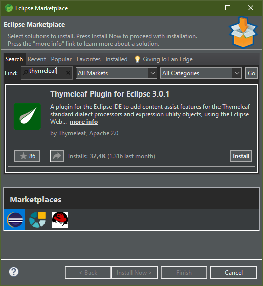
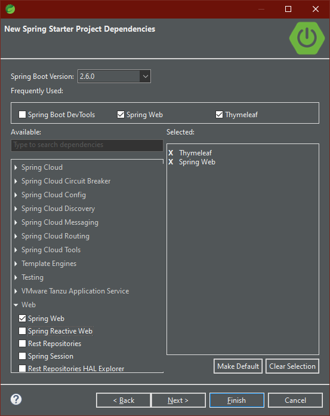
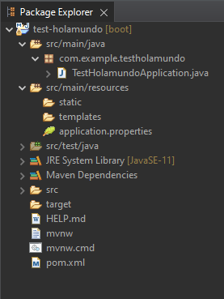
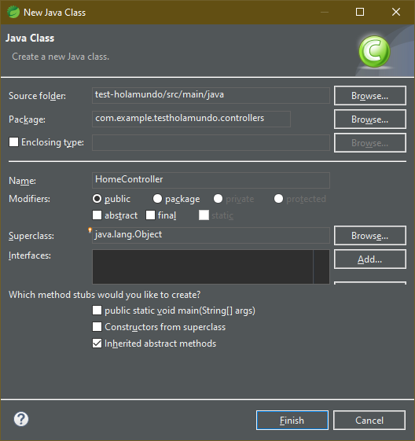
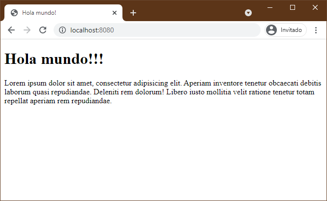

# Índice

[TOC]

------

# Introducción a Spring

## ¿Qué es un framework?

Normalmente cuando trabajamos en cualquier plataforma solemos utilizar algún  tipo de framework. Estos framework no son ni más ni menos que un conjunto de clases que nos facilitan sobremanera el trabajo cotidiano. Utilizamos el framework para crear un conjunto de objetos que nuestra aplicación necesita. 

En la mayoría de las ocasiones para desarrollar la aplicación que necesitamos no nos es suficiente con usar un único framework, sino que necesitamos utilizar varios frameworks. Cada uno de los cuales generará su propio conjunto de objetos, y en muchos casos, dependiendo unos de otros. Y ahí es donde entra Spring.

## Framework Spring

Spring ayuda a solventar este problema ya que cambia las responsabilidades y en vez de que el propio desarrollador sea el encargado de generar los objetos de cada uno de los frameworks, es **Spring** el que lo hace basándose en **ficheros xml o  anotaciones** y será el encargado de construir todos los objetos que la aplicación va a utilizar, asegurándose así que se integran de forma correcta. 

Spring nos ayudará a tener un código desacoplado sobre el resto, de forma que si se cambia la implementación de un objeto (nuevos atributos, constructores o métodos), al no inicializar los objetos nosotros directamente, se podrá cambiar de forma dinámica sus propiedades.

### Características

- **Está escrito en Java**, aunque tiene soporte para Groovy o Kotlin. 
- **Utiliza inyección de dependencias:** Nos ayudará a mantener el código desacoplado, creando clases que no dependan de otras para su creación. 
- **Utiliza inversión del control (IoC):** Un contenedor (*spring container*) es el encargado de gestionar las instancias de los objetos que se utilizan en toda la aplicación.
- **Tiene estructura modular:** Posee módulos que agrupan las distintas funcionalidades que puede tener nuestra aplicación, como Spring Data (para acceso a base de datos, persistencia, JPA, etc.), Spring Security (control de acceso, protección contra ataques, autorización y autentificación, etc.). Sólo incluiremos las necesarias para nuestra aplicación y así disminuiremos la complejidad de la misma.

 # Introducción a Spring Boot

Para entender el concepto de Spring Boot primero debemos reflexionar sobre como construimos aplicaciones con Spring Framework. 

**Fundamentalmente existen tres pasos a realizar.** El primero es crear un proyecto Maven y descargar las dependencias necesarias. En segundo lugar desarrollamos la aplicación y en tercer lugar la desplegamos en un servidor. Si nos ponemos a pensar un poco a detalle en el tema, **únicamente el paso dos es una tarea de desarrollo**. Los otros pasos están más orientados a infraestructura. 

Spring Boot nace con la intención de simplificar los pasos 1 y 3 y que nos podamos centrar en el desarrollo de nuestra aplicación. 

Para generar un proyecto Spring Boot, podemos usar la web http://start.spring.io, la cual nos guiará con un asistente para generar un proyecto con Spring, con las dependencias escogidas, ya previamente configurado casi listo para funcionar. Es independiente del IDE que usemos, puesto que genera un archivo `.zip` con el proyecto escogido listo para que lo importemos desde nuestro IDE. Spring Tool Suite o IntelliJ pueden usar su propio asistente para automatizar todavía más la tarea de generar el archivo .zip, descargarlo e importarlo directamente.

# Instalación Spring Tool Suite

## Descargar

Encontraremos la última versión de Spring Tool Suite en la siguiente dirección:

https://spring.io/tools

## Descomprimir

El IDE viene comprimido en un archivo `.jar`. Tendremos que ejecutarlo para que el archivo `.jar` empiece a auto descomprimirse. Para ejecutarlo, en la carpeta donde tengamos el archivo, escribimos en la consola el siguiente comando:

```bash
java -jar [nombre del archivo descargado].jar
```

> **Nota:** Deberemos tener instalada la JDK de Java y el path correctamente configurado para que funcione directamente en la línea de comandos. O bien poner las rutas absolutas del archivo java.exe y el archivo.jar.

También podemos abrir el archivo `.jar` con 7zip u otro gestor de archivos comprimidos y descomprimir el archivo `contents.zip` de su interior y proceder a su extracción normal. 

Obtendremos una carpeta llamada `/sts-4.x.x.RELEASE`. La podremos mover a la ubicación que deseemos ya que es una versión portable que ya trae una JDK open source lista para empezar.

## Puesta en marcha

La primera vez que arrancamos STS nos preguntará la ubicación de nuestro directorio de trabajo (*workspace*). 


Podemos seleccionar que use la ruta indicada como ruta por defecto y ya no nos volverá a preguntar. Siempre podremos cambiar esto más adelante.

Para poder ejecutar una aplicación con Spring Boot no necesitaremos tener ningún servidor configurado ya que los proyectos vendrán con un servidor Tomcat embebido.

### Preferencias recomendadas

Entraremos en *Window -> Preferences*, y ahí:

- **Tema oscuro:** Cansa menos la vista. *General -> Appearance -> Theme Dark*.
- **Seleccionar navegador externo:** Por defecto, usa un navegador interno. Elegiremos uno externo en *General -> Web Browser -> Use external web browser ->* Y seleccionamos uno de la lista que tengamos instalado.
- **Corrector ortográfico:** Por defecto ya está activado y en inglés. Podemos añadirle un diccionario manualmente en *General -> Editors -> Text Editors -> Spelling -> Dictionaries -> Browse ->* Y elegimos el diccionario en español que podemos [descargar de aquí](https://github.com/borilio/curso-spring-boot/tree/master/assets/diccionario). Seleccionar la codificación UTF-8 para el diccionario para que funcione correctamente.
- **Auto Save**: Configurar que los archivos se vayan guardando automáticamente cada pocos segundos y nos evitaremos sorpresas. *General -> Editors -> Autosave -> Enable autosave* y le indicamos el intervalo en segundos.
- **Ampliar buffer de la consola:** Por defecto, la consola viene con un buffer pequeño, el cual la primera vez que ejecutemos la aplicación SpringBoot, nos dará un aviso. Si lo arreglamos desde ya, no tendremos luego interrupciones. Vamos a *Run/Debug -> Console -> Marcamos "Limit console output" y establecemos "Console buffer size (characters)"* a un valor más alto, 1.000.000 aprox. También podemos desactivar el límite. No habría diferencia de rendimiento visible entre las dos opciones.

### Plugins recomendados

- **Plugin Thymeleaf:** Por defecto, STS no muestra como opción "Nuevo -> Archivo HTML" para la creación de plantillas. Deberemos instalar este plugin para poder crearlas con más facilidad.
  - Pulsamos *Help -> Eclipse Marketplace -> Find -> Escribimos "Thymeleaf" -> Thymeleaf Plugin for Eclipse 3.xx -> Install*
   
  - Aceptaremos la licencia y reiniciamos (si vamos a instalar más plugins, podemos instalarlos todos y al reiniciamos al final).
  - Ya podremos crear documentos HTML en nuestro proyecto usando un asistente, crear nuevas plantillas y modificar las existentes, al crear nuevos documentos.
- **Plugin Emmet:** Añade una serie de atajos de teclado muy populares (viene incluido en Visual Studio Code por defecto).
  - Pulsamos *Help -> Eclipse Marketplace -> Find -> Escribimos "emmet" -> Emmet (ex-Zen Coding) Eclipse plugin 1.0.0 -> Install*
   
  - Aceptaremos la licencia y reiniciamos.
  - Ya podemos usar las abreviaturas de *Emmet* (expandir etiquetas con tab, usar expresiones del tipo `div*5>p.small{Caja nº$}`.
  - **Importante:** Emmet añade unos atajos de teclado que nos impiden escribir los corchetes `[` `]`. Podemos eliminarlos entrando en *Window -> Preferences -> General -> Keys ->* Y filtrar por 'Edit Point'. Aparecerán dos atajos de Emmet (Next y Previous Edit Point). Eliminarlos con 'Unbind command'. Probar en cualquier ventana del editor que podemos escribir los corchetes.

# Hola Mundo!

Una vez configurado el entorno, vamos a crear nuestra primera aplicación y hacerla funcionar, para asegurarnos que todo está bien instalado y no tendremos futuros problemas.

Tenemos dos opciones:

- Ir a https://start.spring.io/ y crear el proyecto desde la web y obtener un zip para importarlo en el IDE que queramos.
- Usar el asistente integrado que se incluye en Spring Tool Suite 4 (o en otros IDE's como IntelliJ), que nos irá preguntando que queremos hacer, hará una petición a la web anterior, lo descargará e importará automáticamente. 

## Nuevo proyecto

Vamos a ver los pasos usando Spring Tool Suite 4.

1. Iniciamos el asistente con **File -> New -> Spring Starter Project**
   - **Service URL:** Es la url de la web que nos generará el proyecto. Dejamos la que viene.
   - **Name:** Este será el nombre del proyecto. Por ejemplo, test-holamundo.
   - **Location:** Dejamos que use la localización por defecto, que es dentro de nuestro workspace.
   - **Type:** Dejamos Maven Project. También se puede usar Gradle como gestor de proyectos.
   - **Packaging**: Lo dejamos en Jar (ya que se ejecutará como un proyecto Java básico, y no web, aunque internamente sea web😎).
   - **Java Version:** Lo dejamos en la que venga por defecto, pero aquí es donde elegiremos la versión de JDK que usará nuestra aplicación.
   - **Language:** Lo dejaremos en Java, pero si lo quisiéramos hacer el Kotlin o Groovy, aquí se cambiaría.
   - **Group y Artifact:** Aquí pondremos el nombre del *groupID* y *artifactID* de la aplicación. Se suele usar el nombre del paquete base y de la aplicación respectivamente. Por ejemplo: La aplicación de [Facebook en Android](https://play.google.com/store/apps/details?id=com.facebook.katana&gl=ES) usa la id `com.facebook.katana`, y la aplicación de [Facebook Messenger](https://play.google.com/store/apps/details?id=com.facebook.orca&gl=ES) usa `com.facebook.orca`. Así Facebook usa en general para todas las aplicaciones de la misma empresa `com.facebook`, **ese es su groupID**, y cada aplicación tiene su propio nombre, el **artifact**, `katana, orca, mlite`, etc.
   - **Version**: Es el número de la versión de la aplicación. Lo dejaremos con lo que viene por defecto.
   - **Description:** Es la descripción larga de la aplicación. Lo dejaremos con lo que viene por defecto. 
   - **Package:** Es el paquete base donde creará la clase inicializadora de Spring Boot. Suele ser group+artifact. Por ejemplo: `com.facebook.katana`. 
   - **Importante:** Tanto el group, artifact y package, como indican el nombre de un paquete en java, deberá seguirse la nomenclatura de los paquetes en Java, todo en minúsculas, sin espacios en blanco ni camel case ni ningún símbolo.
2. Dejamos como en la captura y pulsamos siguiente.
3. 
4. En la siguiente pestaña **seleccionaremos las dependencias que tendrá nuestro proyecto** inicialmente configuradas en nuestro Maven. Después podremos editar el archivo `pom.xml` para añadir o eliminarlas a nuestro antojo. En el cuadro de "Buscar" podemos empezar a escribir el nombre de la dependencia que queramos y a continuación marcamos su checkbox. **Le añadiremos las siguientes.**
   - **Thymeleaf**: Usaremos Thymeleaf como gestor de plantillas.
   - **Spring Web:** Incluye todo lo necesario para crear un proyecto Web usando MVC y un Apache Tomcat embebido como contenedor web. Todo ya configurado y listo para funcionar.
   - Y listo. Para nuestra primera aplicación no incluiremos más dependencias para simplificar. Más adelante, aquí es donde incluiremos las depencias para Spring Data, JPA, JDBC, MySQL o los Repositorios REST.
   - Una vez marcadas, podemos pulsar el botón de "*Make Default*", para que por defecto, todos los proyectos que creemos ya tengan esas dependencias. También podemos observar que arriba del todo nos mostrará las dependencias que con más frecuencia usemos (la primera vez que creemos un proyecto no saldrán).
   - 
5. Y ya podemos pulsar ***Finish***. Si pulsamos *Next* nos sale un resumen de la petición que se hará a la url indicada en el punto 1.
6. La web spring.io creará un proyecto, STS se lo descargará e importará automáticamente. Maven construirá el proyecto descargándose todas las dependencias necesarias y cuando en la barra de estado (abajo a la derecha) no veamos actividad alguna, es que nuestro proyecto ya está terminado. La primera vez que se descargan todas las dependencias puede tardar más. En próximos proyectos usará la caché de Maven y tardará menos.

## Estructura de proyecto

Nos habrá creado una proyecto con la siguiente estructura:



Destacaremos los siguientes archivos y carpetas:

- `src/main/java` -> Contiene los archivos fuente en java. Ahí crearemos los paquetes y las clases que necesitemos en nuestra aplicación.
- `src/main/resources`
  - `/static` -> Aquí crearemos los recursos estáticos, como imágenes, videos, css, etc. 
  - `/templates` -> Aquí crearemos las vistas en HTML usando Thymeleaf.
  - `application.properties` -> Archivo *bundle* de configuración que sustituirá a todos los xml de versiones anteriores de Spring. Ahora mismo está en blanco, pero aquí estableceremos por ejemplo, los parámetros de la conexión a la base de datos.
- `pom.xml` -> Archivo de configuración de Maven (Project Object Model). Aquí configuraremos las dependencias de Maven como en cualquier otro proyecto Java.

Ahora mismo tenemos la estructura de una aplicación JavaEE, pero sin vistas ni servlets, por lo que no podemos ejecutarla por ahora. 

## Añadiendo código

Siguiendo el patrón MVC, crearemos un **controlador** inicial que nos lleve a una **vista**. Más adelante explicaremos con detalle el código. 

Crearemos un nuevo paquete llamado `controllers`, en la clase base que ya tengamos, `com.example.testholamundo` en nuestro ejemplo. En ese paquete crearemos una clase llamada `HomeController.java`. Pueden hacerse los dos pasos juntos, haciendo:

- Botón derecho sobre el paquete `com.example.testholamundo` -> New -> Class -> Y en el paquete **añadimos** al que hay `.controllers`, y escribimos el nombre de la clase `HomeController`

  

- Reemplazamos el código que haya en la clase `HomeController.java` por el siguiente. Más adelante explicaremos su contenido.

```java
  package com.example.testholamundo.controllers;
  import org.springframework.stereotype.Controller;
  import org.springframework.web.bind.annotation.RequestMapping;
  
  @Controller
  public class HomeController {
  	@RequestMapping("/")
  	public String home() {
  		return "home";
  	}
  }
```

- En la carpeta `src/main/resources/templates`, pulsamos botón derecho -> New -> Other... -> Buscamos HTML y seleccionamos "HTML File" -> Le llamamos `home.html` -> Y seleccionamos la plantilla New HTML File (5). Más adelante modificaremos las plantillas.

- Reemplazamos el código que haya en el archivo  `home.html` por el siguiente. Más adelante explicaremos su contenido. 

```html
  <!DOCTYPE html>
  <html lang="es" xmlns:th="http://www.thymeleaf.org">
      <head>
          <title>Hola mundo!</title>
          <meta charset="UTF-8"/>
      </head>
      <body>
  		<h1>Hola mundo!!!</h1>
  		<p>Lorem ipsum dolor sit amet, consectetur adipisicing elit.</p>	
      </body>
  </html>
```

Y ya tendremos un **controlador** que nos redirecciona a una **vista**. Ahora si podemos ejecutar la aplicación y verla en funcionamiento.

## Ejecutar la aplicación

En este punto, ya podemos pasar a ejecutar la aplicación. A diferencia de una aplicación JavaEE convencional, no necesitamos disponer de un servidor Apache Tomcat (o cualquier otro contenedor web) externo o interno en Eclipse o STS, configurado para poder desplegar la aplicación en él. 

Spring Boot crea una aplicación Java normal, que al ejecutar la clase con el método main() `TestHolamundoApplication.java` , realizará todo el proceso de compilar, desplegar y arrancar la aplicación en un servidor Tomcat embebido y listo para usar. 

Para ello, seleccionamos el proyecto -> botón derecho -> Run as ... -> Spring Boot App.

> **Nota:** La primera vez es posible que nos salten avisos del Firewall de Windows. Si tenemos permisos de administrador, le damos permiso y seguimos. Sólo saldrá una vez. 


Por la consola nos mostrará toda la información sobre la aplicación, despliegue, estado del servidor, mapeo de rutas, base de datos, etc. Cuando termine todo el proceso automático, ya podemos ir a http://localhost:8080 y allí nos aparecerá nuestra página `home.html`.



También podemos usar el **Boot Dashboard**. Está ubicado en la esquina inferior izquierda (a la izquierda de la consola). Desde ahí podremos (en el mismo orden):

- Iniciar o reiniciar la aplicación
- Iniciar o reiniciar en modo debug
- Parar el servidor Tomcat 
- Abrir la url de la aplicación en el navegador configurado por STS4. [Ver apartado preferencias recomendadas](#preferencias-recomendadas).


# Spring Boot Dev-Tools

Spring Boot ofrece unas herramientas para desarrolladores que nos permitirá una recarga automática del proyecto y despliegue en el servidor cada vez que se produzca un cambio. Así no tendremos que estar reiniciando el servidor manualmente ni recargando el navegador.

Para empezar a usar *Dev Tools* podemos elegirlas al inicio de la creación de un proyecto, seleccionando la dependencia `Spring Boot DevTools`. También podemos añadirla manualmente al `pom.xml` si el proyecto ya estuviese creado. Deberemos parar el servidor y volver a arrancarlo.

```xml
<!-- Añadir al pom.xml -->
<!-- Dependencia de Maven para Spring Boot DevTools -->
<dependency>
  <groupId>org.springframework.boot</groupId>
  <artifactId>spring-boot-devtools</artifactId>
</dependency>
```

Si queremos que el navegador se recargue automáticamente cada vez que haya cambios en el servidor, debemos instalar el plugin de [livereload para Chrome](https://chrome.google.com/webstore/detail/livereload/jnihajbhpnppcggbcgedagnkighmdlei). En Chrome habrá que habilitarlo primero (haciendo un clic sobre su icono) y después configurarlo para tenga acceso a localhost y ya funcionará directamente (es importante el orden, primero habilitar el plugin, y después ponerlo en localhost).

# Ventajas de Spring y SpringBoot respecto a JavaEE

**Usando Spring Framework nos hemos ahorrado:** (respecto a una app JavaEE)

- Crear un Servlet. En un servlet hay que sobrescribir al menos un método que reciba las peticiones, o el `doGet()` o el `doPost()`. El servlet debe heredar de la clase `HttpServlet`.
- Que dicho servlet nos redirija a la vista usando la interfaz `RequestDispatcher` o `response.sendRedirect()`. Mínimo son 3 o 4 líneas de código en el/los método(s) anteriormente mencionado.
- Registrar el servlet en el archivo de configuración xml. Hay IDE's que lo registran por nosotros, otros no.
- Registrar cada una de las url que podemos gestionar con el servlet, o bien usando anotaciones o bien usando el xml de configuración.

**Usando Spring Boot nos hemos ahorrado:** (respecto a una app Spring "normal")

- Instalar y configurar un servidor Apache Tomcat.
- Desplegar la aplicación en el servidor.
- Tener que añadir manualmente todas las dependencias iniciales en Maven en el `pom.xml`.
- Crear una estructura de directorios para albergar todos los recursos de nuestra aplicación.

**Y TODO ESTO EN UNA APLICACIÓN CON UN ¡¡¡ HOLAMUNDO !!!**. Si nuestra aplicación usa base de datos (MySQL o cualquier otra), persistencia, conectores, repositorios JSON, autentificación, seguridad, herramientas de desarrollo... las ventajas se multiplican.


