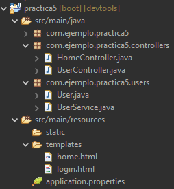

# Índice

[TOC]

------


# @RequestParam. Obtener los parámetros de la petición

Cada vez que enviamos desde un formulario valores (por método GET) o bien directamente desde la url de nuestro navegador, se envían de la siguiente forma:

> http://ejemplo.com/borrar?id=34&confirmar=true

Desde la url (o formulario) estamos adjuntando en el request los siguientes parámetros:

- `id = “34”`

- `confirmar = “true”`

Esta información llega al recurso `borrar` (servlet, jsp, controlador, etc.) y puede extraerse de las siguientes formas:

**Desde Java**

```java
@RequestMapping("usuario/validar")
public String validarLogin(HttpServletRequest request){
    // Recuperamos los parámetros
    String nombre = request.getParameter("nombre");
    String pass = request.getParameter("pass");
   	// Creamos el usuario con los valores recibidos
    User usuario = new User(nombre, pass);
	// Vamos a la vista que queramos
    if (esValido(usuario)) {
        return "home";
    } else {
        return "login";
    }
}

```

Como los parámetros están en el request, necesitamos inyectarlo al método. Una vez dentro, los extraemos con `request.getParameter("email")`, el cual **SIEMPRE** nos devolverá un String, independientemente de la naturaleza del dato que haya dentro. 

Así es básicamente como lo hacíamos en una aplicación JavaEE por lo que no hay mucha novedad, y siempre podemos seguir haciéndolo así. Pero ahora **con Spring poseemos una forma más eficiente usando anotaciones.**

**Desde Java con anotaciones**

Veamos exactamente el mismo ejemplo anterior, pero usando la anotación `@RequestParam()` para recuperar parámetros de la petición:

```java
@GetMapping("/usuario/validar")
public String validarUser(
    @RequestParam("nombre") String nombre, 
    @RequestParam("pass") String pass
){
    // Creamos el usuario con los valores recibidos
    User usuario = new User(nombre, pass);
	// Vamos a la vista que queramos
    if (esValido(usuario)) {
        return "home";
    } else {
        return "login";
    }
}
```

Así podemos recuperar parámetros de la petición directamente, ya vengan de un formulario o en la misma url. 

**Las ventajas son:**

- No hace falta inyectar el `HttpServletRequest` para después usar el método `.getParameter()`. Directamente extraemos los parámetros y se “vuelcan” en la variable que le digamos (`nombre` y `pass` en este caso).

- El método `request.getParameter()` SIEMPRE devuelve un String, por lo que si recibimos un número, deberemos hacer la conversión explícita manualmente. Con `@RequestParam`, podemos volcar el contenido de un parámetro en **una variable del tipo que queramos**, y se realizará la conversión de tipo automáticamente, como veremos en el siguiente ejemplo. Se deberán usar clases envoltorio en lugar de variables de tipo primitivo, para poder albergar un `null` en algunos casos (un primitivo no puede valer `null`, un objeto de una clase envoltorio si).

- Si el nombre del parámetro coincide con el nombre de la variable, podemos omitir el nombre del parámetro. Si no coincidiera entonces es cuando usaríamos los paréntesis indicando ambos identificadores. Ejemplo:

- ```java
  //>>> Si coinciden ambos identificadores, podemos omitirlo en la anotación
  @RequestParam("nombre") String nombre
  @RequestParam String nombre 
  
  //>>> Si no coinciden, indicamos ambos identificadores para asociarlos
  @RequestParam("n") String name
  ```

- Podemos asignar un valor por defecto a los parámetros. Si no llegara ese parámetro al controlador porque no fuese enviado, no tendríamos que controlarlo manualmente, si no que se le aplicaría un valor por defecto.

- ```java
  //>>> Valor por defecto a los parámetros recibidos en una petición
  @RequestParam(defaultValue="29", name="code") int provincia
  ```

- Si un parámetro existe, pero no puede hacer la conversión implícita de tipos, se lanzará una excepción `TypeMismatchExcepcion`. Por ejemplo, nos han enviado un texto y le hemos dicho que se guarde en un entero.

- Podemos indicarle si son requeridos o no. Por defecto todos los parámetros son `required=true`. Esto provocará que se lance una excepción del tipo `MissingServletRequestParameterException` si el parámetro no está incluido en la petición. Se puede poner a `false` si queremos que lugar de una excepción, nos devuelva un `null` en caso de que no venga. 

- ```java
  @RequestParam(required=false) Integer id
  ```

- Las variables que albergan los parámetros deberán ser una clase envoltorio en lugar de primitivo (`Integer`, `Double`, `Float` en lugar de `int`, `double`, `float`, etc.), para poder albergar un `null`. En el ejemplo, si no llega ningún parámetro llamado `id` en la petición, el **objeto** `id` valdrá `null`. Si ponemos `required=true` o no ponemos nada, saltará una excepción.


Veamos otro ejemplo para verlo en otro contexto.

```java
@RequestMapping(value = "/borrar", method = RequestMethod.GET)
public String borrar(@RequestParam(name="id", required=false) Integer identificacion){
    //Vamos a borrar un usuario por id recibida
    BaseDatos db = new BaseDatos();
    if (identificacion!=null) { //si no es null...
	    db.borrarUsuario(identificacion);        
    }
    return "listado";
}
```

Lo que hacemos es inyectar la variable (`Integer identificacion`) que va a recoger el valor recibido por GET, y con la anotación `@RequestParam("id")`, le estamos diciendo que el valor del parámetro del request que se llame “id”, se meta en la variable `Integer identificacion`.

Se ha usado una clase envoltorio `Integer` para la variable `identificacion`, ya que al tener el `required=false`, en caso de no llegar en la petición ningún parámetro con nombre `id`, `identificacion` valdrá `null`. Si ponemos `required=true` o nada, se lanzará una excepción de tipo `MissingServletRequestParameterException` y la ejecución del programa se parará.

En el `@RequestParam()`, si se indican más de un atributo (`name` y `required`), han de indicarse con pares de nombre=valor separados por comas. Si solo se indica el nombre del parámetro, solo seria necesario indicarle el valor Ej: `@RequestParam("id")`. 

> 🤓Más información en https://www.baeldung.com/spring-request-param

> 🤓Si el nombre del parámetro coincide con el nombre de la variable a la cual estamos mapeando con `@RequestParam`, podemos omitir la anotación, como en el siguiente ejemplo:
>
> ```java
> public String login(Integer id, String correo, String clave){...}
> ```

------

## Práctica 3

Hacer una aplicación Spring Web que haga lo siguiente:

- Usar la clase [Planeta del repositorio del curso](https://github.com/borilio/curso-spring-boot/tree/master/assets/clases/practica-3) e incluirla en el proyecto dentro de un paquete llamado pojos.
- El controlador principal, nos llevará a una página inicial que es un formulario que tiene:
  - Un cuadro de texto normal con el nombre de la galaxia que vamos a crear.
  - Un cuadro de texto (de tipo number con límite inferior y superior, mínimo 1, máximo 1.500) para introducir el número de planetas que queremos crear.
- El formulario enviará la información por método `GET` a la url `/crear` .
- Creamos un método en un controlador (nuevo o el principal) para recibir la información en `/crear` y hacer:
  - Extraemos los parámetros de la petición (nombre de la galaxia y número de planetas). Probar a imprimirlos por consola `System.out.println()` para asegurarnos que los estamos recibiendo correctamente.
  - El número de planetas NO ES OBLIGATORIO, por lo que podrían enviar el formulario sin rellenar el campo. En ese caso, se creará una galaxia genérica de 500 planetas. No debería de saltar ninguna excepción.
  - La clase Planeta, posee un constructor por defecto, que crea un Planeta con valores aleatorios. (`Planeta p = new Planeta()`)
  - Creamos un `Arraylist` de Planetas, y lo llenamos de tantos planetas (usando el constructor que crea planetas aleatorios) como hayamos indicado en el formulario.
  - Una vez creada la galaxia, enviaremos el nombre y la lista de planetas a una vista llamada `listado.html` (a la cual tendremos que mapear su url `/listado` para poder acceder a ella). 
- Para asegurarnos que el objeto `ArrayList<Planeta>` llega a la vista, mostrar inicialmente el contenido del mismo sin en un párrafo o algo similar de la forma más simple posible.
- Una vez que sabemos que el objeto ArrayList llega correctamente a la vista, deberemos mostrar el nombre de la galaxia, y una tabla HTML con los planetas y sus atributos.
- Si tuviéramos que mostrar el número de planetas que pueden albergar vida. ¿Cómo lo haríamos?

------

# @PathVariable. Obtener parámetros con url amigables

```java
@GetMapping("/borrar/{id}")
public String borrar(@PathVariable Integer id){
    //Vamos a borrar un usuario por id recibida
    BaseDatos db = new BaseDatos();
    if (id!=null) { //si no es null...
	    db.borrarUsuario(id);        
    }
    return "listado";
}
```

Si antes usábamos `/borrar?id=3` para enviar un parámetro a un recurso, ahora podemos usar `/borrar/3` para obtener el mismo resultado. Solo tendríamos que cambiar la forma en la que recibimos la variable, `@PathVariable` en lugar de con `@RequestParam`.

Spring se encargará de capturar el valor que esté entre llaves `{id}` y colocar en otra variable que nosotros le indiquemos en la firma del método. En el ejemplo anterior, haríamos una consulta a la url `/borrar/3`, de forma que el `3` lo captura, mete el valor dentro de la variable `Integer id`, y después la usa en el método de la forma que quiera.

Solo funcionaría con enlaces y url puestas a mano, no podríamos enviar un formulario ya que el formulario lo envía por parámetros en la petición. Pero obtendríamos url más amigables, fácil de recordar y de manipular por el usuario, para lo bueno y lo malo.

Pasa igual que con `@RequestParam`, que si la variable indicada entre llaves, coincide el identificador con el de la variable “receptora”, no hace falta indicarle el identificador en la anotación `@PathVariable`.

```java
//Coinciden (id -> id), podemos obviar el identificador
@GetMapping("borrar/{id}")
public String borrar (@PathVariable Integer id) 

//No coinciden (idEmpleado -> id), así que indicamos identificadores
@GetMapping("borrar/{idEmpleado}")
public String borrar(@PathVariable("idEmpleado") Integer id) 
```


------

## Práctica 4

Añadir un nuevo método a la práctica 3, para usar una url amigable en lugar del formulario. Es decir, que si voy a la url `/crear/andromeda/4000000` directamente sin usar el formulario, debería llevarme a `listado.html` y mostrar la misma tabla. Probar que ambas formas coexisten perfectamente.

💡No intentes reaprovechar el código ya existente en el otro método. Copia las líneas que se tengan que repetir del anterior.

💡Pero… ¿y si queremos aprovechar el código ya escrito? Nos vendría bien algo como `redirect:/crear?...`

------

# Scopes

Para que una aplicación web use un objeto, ese objeto necesita mantener su estado durante la interacción entre el usuario y la aplicación. La manera de mantener su estado es “colocando” el objeto en un ámbito (scope) dependiendo de cómo vayamos a usarlo. Los ámbitos más usados son los siguientes: 
- **Request**: Su duración está limitada a lo que dure la petición http de un usuario. De una página a otra se suele generar una nueva petición, por lo que se perderían esos valores (si no se vuelven a recuperar).
  - **Ejemplo**: Una lista de clientes, la insertaremos en el requestScope desde el controlador, para que en la vista pueda recuperar ese valor y representarlo. Los parámetros de un formulario siempre van incrustados en el requestScope.

- **Session**: Su duración está limitada a la interacción de un usuario, a través de todas las peticiones http que genere él mismo.
  - **Ejemplo**: Un objeto de clase Usuario, lo insertaremos al sessionScope, para tenerlo accesible desde cualquier punto de la aplicación (servlet, controlador, vista, etc.) sin tener que estar reenviándolo de recurso a recurso (controlador a vista, vista a otra vista, etc.).

- **Application**: Su estado es compartido a través de todos los usuarios de la aplicación y de sus peticiones http.
  - **Ejemplo**: Un objeto `ArrayList<Usuario>` que mantenga una lista de los usuarios conectados a la aplicación, deberá estar en éste scope, ya que así cualquier usuario podrá acceder a este objeto para poder mostrar el resto de usuarios conectados, y poder insertar o eliminar elementos (para inscribirse y borrarse de la lista).


Veamos a continuación con detalle cada uno de los scopes, las formas de insertarlos en el controlador y recuperarlos desde las vistas.

## Request Scope

Cada vez que se produce una petición al servidor, se genera un nuevo Request, una vez que la petición se realiza, este termina. Por ejemplo, tenemos 3 páginas, login, menú principal y listados. Cuando entramos en login, creamos un Request para ir a menú principal. El request “muere” ahí, perdiendo todo lo que hubiese en él, y si ahora accedemos a listados, estaríamos creando un nuevo Request, sin los valores que hubiese en el anterior. 

Tendremos que ocuparnos nosotros de ir conservando los objetos de un request a otro si los queremos mantener, de ahí que existan varios ámbitos, ya que sería un incordio tener que mantener el estado de TODOS los objetos entre distintos request.

Vamos a ver como se trata el objeto request desde los siguientes elementos de la aplicación:

**Desde Java**

```java
@RequestMapping("logout")
public String logout(HttpServletRequest request) {
    //Creamos un usuario con un username y un password
    User usuario = new User("bori@tutor.com", "12345");
    //Insertamos el objeto en el request, asignándole un nombre
    request.setAttribute("usuario", usuario);
    return "logout";
}
```

**Desde la vista**

```html
<p th:text="${request.usuario}"></p>
<p th:text="${usuario}"></p> <!-- Lo encontrará igualmente -->
```

En el primer ejemplo, referenciamos el objeto que está en el scope del request. Si fuese un objeto con más atributos podríamos poner `${request.usuario.nombre}` 

En el segundo ejemplo, no se le indica el ámbito al objeto, pero igualmente lo encontrará. Primero buscará en `request`, después en `session` y después en `application`. Aunque es una buena práctica indicar explícitamente dónde está el objeto, para evitar accesos erróneos inesperados.

En JavaEE, al trabajar con servlets, siempre estaba el objeto request (`HttpServletRequest`) en los `doGet` y `doPost`, por lo que así es como se enviaban objetos de unos recursos a otros. En **Spring tenemos el `model`, lo cual es más apropiado y liviano que inyectar todo el request completo**, el cual tiene mucha más información que puede que no necesitemos. Pero si nos hiciese falta por cualquier motivo así se usaría.

## Session Scope

A veces, es muy útil insertar un objeto en un “lugar” y tenerlo accesible durante todo el tiempo que dure la sesión del cliente, por ejemplo, el usuario activo. A ese ámbito se le llama **session Scope** y su alcance es desde que el servidor recibe una petición de un cliente, hasta que cierra la conexión con el mismo. Así no sería necesario estar enviando la información de request en request si queremos mostrarla en las vistas.

Se puede cerrar de forma manual invalidando la sesión con `session.invalidate()`, o bien el servidor cerrará de forma automática la sesión si no detecta actividad (peticiones) durante un tiempo estipulado en el archivo `application.properties`. Si no se indica nada, por defecto serán 30 minutos. En aplicaciones JavaEE y Spring Legacy, se indicaba en el descriptor del proyecto, el `web.xml`.

```properties
#application.properties
#Server Configuración
server.servlet.session.timeout=10m
```

Así se indicaría que se necesitan 10 minutos de inactividad para el cierre de sesión automática por parte del servidor. Si no se indica ningún sufijo de tiempo, la cantidad se usará en segundos. 

> **Nota:** Para una lista completa de configuraciones que se pueden aplicar al servidor en el `application.properties`, mirar en https://docs.spring.io/spring-boot/docs/3.0.x/reference/html/application-properties.html#application-properties.server

Veamos un ejemplo muy usado para el ámbito de la sesión, que sería guardar el usuario activo:

**Desde Java**

```java
@GetMapping("/usuario/validar")
public String validar(HttpSession session){
    User usuario = new User(1, "Gregorio", "12345");
    if (esValido(usuario)) {
        session.setAttribute("usuarioActivo", usuario);
        return "home";
    } else {
        return "login";
    }
}

@GetMapping("/usuario/logout")
public String logout(HttpSession session) {
    session.invalidate();
    return "login";
}
```

Tenemos dos métodos:

- `validar()` -> Creamos un usuario, y lo insertaría si pasa una supuesta validación. Si la pasa, vamos a la vista `validar`, en caso contrario de que no pase la validación lo mandaríamos a la vista `login` (para que se identifique de nuevo por ejemplo).
- `logout()` -> Invalidamos la sesión, y vamos a la vista `validar`.

En ambos métodos, inyectamos el objeto `HttpSession`, y lo usamos o bien para añadirle los objetos que queramos con `.setAttribute()` o bien para invalidar la sesión con `.invalidate()`. Si necesitamos recuperar objetos ya insertados previamente usaríamos el método `.getAttribute()`, el cual devuelve un Object, por lo que tendríamos que hacerle el casting correcto. Por ejemplo, para recuperar el mismo objeto de la clase `User` que metimos en la sesión, sería:

```java
User userRecuperado = (User) session.getAttribute("user");
```

También se puede usar la anotación `@SessionAttribute` en la firma del método y funciona de forma parecida a como ya lo hacen `@RequestParam` y `@PathVariable`. Esto nos ahorraría tener que inyectar el `HttpSession`, usar el `.getAttribute()` y hacer el casting.

```java
@RequestMapping("/")
public String login(@SessionAttribute(value="user", required=false) User userActivo) {
    if (userActivo != null) {
        return "home";
    } else {
        return "login";
    }
}
```

Una vez visto como lo guardamos desde el controlador en la sesión, veremos como recuperar esa información desde la vista.


**Desde la vista**

```html
<h3>Validar usuario</h3>
<div th:if="${session.user}"> 
    <p>Bienvenido, [[${session.user.nombre}]]</p>
</div>
<div th:unless="${session.user}">
    <p>No hay usuario en la sesión</p>
</div>
```

En la vista, recuperamos el objeto `user`, que si venimos de `validar()` si existirá en el sessionScope, y si venimos de `logout()` no. 

---

### Práctica 5

Hacer una aplicación en Spring Boot que simule una autentificación de usuario. La web inicialmente nos lleva a `login.html` y si la validación es correcta, nos lleva a la página principal de la aplicación, `home.html`. 



**Crear la siguiente estructura de paquetes / clases:**

- Paquete `controllers`
  - `HomeController`: Llevará directamente a `login.html`.
  - `UserController`: Controlará las url para validar usuario y cerrar sesión de usuario.
- Paquete `users` -> Estas clases están en el [repositorio de la práctica](https://github.com/borilio/curso-spring-boot/tree/master/assets/clases/practica-5). Habrá que corregir la ruta de los paquetes que hayas usado en tu proyecto.
  - Clase `User`: Es un pojo que representa un usuario dentro de la aplicación.
  - Clase `UserService`: Es un servicio (se detallarán más adelante) que hace una simulación de una validación, devolviendo true si el usuario es válido (si su contraseña es 12345 🙂).

**Crear las siguientes vistas:**

- `login.html` -> Es un formulario con dos cuadros de texto que envía la información al `UserController`,  a `/usuarios/validar` por método `POST`. 
- `home.html` -> Es la simulación de una página principal. Un mensaje de bienvenida y un menú con varias opciones de adorno. Una de ellas pondrá “Cerrar Sesión”.

**En los controladores:**

- `/usuarios/validar` -> Extraemos los valores de la petición. Creamos un objeto `User` con los valores extraídos, y:
  - Si son válidos (que el password sea ‘12345’) tenemos que ir a `home.html`, pero insertando el usuario ya validado en la sesión.
  - Si no es válido tendremos que volver a `login.html`, enviando un mensaje de “Usuario y/o contraseña no válidos” para la vista.
  - Para comprobar si un usuario es válido o no, podemos comprobarlo manualmente, o bien usando la clase `UserService`, que tiene un método llamado `.validar()` que recibe un usuario y devuelve un true si la contraseña es 12345 o false en caso contrario.
- `/usuarios/logout` -> Invalidaremos la sesión actual, y nos vamos a `login.html`. Usaremos esta url en la opción del menú principal “Cerrar sesión”.
- `/` -> Inicialmente íbamos directos a `login.html`. Ahora tendremos que comprobar primero:
  - Si hay un usuario en la sesión, en ese caso vamos a `home.html` (si existe el usuario en la sesión, ya está validado, por lo que no hay que comprobar nada más).
  - Si no hay un usuario en la sesión, es que no hay sesiones activas por lo que seguimos yendo a `login.html`, como hacíamos inicialmente.

Si cerramos el navegador y volvemos a entrar en la app, mientras siga la sesión abierta, nos deberá llevar directamente `home.html` (en vez de a `login.html`). Si no hay sesión activa, será cuando vayamos a `login.html`.

Si todo va bien, no habrá posibilidad de ir a la página principal sin iniciar sesión validando al usuario primero.


## Application Scope

Es el ámbito más global y es compartido por todos los elementos de la aplicación. Si antes cada cliente tenía su propio “espacio”, ahora ese espacio es compartido por todos los clientes que se conecten a la aplicación. 

Es decir, ese espacio se declara cuando el servidor arranca la aplicación y mantiene el estado de todos los atributos (objetos) que haya en él, incluso entre sesiones de distintos usuarios, hasta que el servidor cierre o reinicie la aplicación. 

Aquí sólo se colocarán atributos globales que deban compartirse entre distintos clientes. Un ejemplo sería un contador de visitas, un contador de promociones entregadas o una lista de usuarios conectados. Cada usuario tiene su propio espacio (sesión) pero para tener una lista de TODOS los usuarios conectados simultáneamente a la aplicación tendríamos que usar el ApplicationScope (añadiendo el usuario a la lista en el momento que inicia la sesión y eliminándolo de la lista cuando cierra sesión).

> **⚠** El ApplicationScope (o ContextScope) no es seguro. Hay un problema. Cualquiera en la aplicación tiene acceso a los atributos de éste scope, y eso significa que habrá múltiples servlets, y múltiples servlets significan múltiples hilos de ejecución simultáneos. Un hilo de un cliente “A” puede modificar los atributos del ApplicationScope de forma que al cliente “B” se le muestre un resultado inesperado debido a que el estado del atributo ha cambiado en el transcurso de la ejecución.

**Desde Java**

```java
@Controller
public class HomeController {
    @Autowired
    private ServletContext context;

    @RequestMapping("/registrar-visita")
    public String registrar(){
        //Guardamos algo en el applicationScope
        Integer c = (Integer) context.getAttribute("contador");
        if (c == null) { //Si es nulo, es porque no existía
            c = 0;       //así que lo inicializamos
        }
        context.setAttribute("contador", ++c); //sumamos una visita y agregamos
        return "home";
    }
    
    . . .
}//Fin HomeController

```

En los servlets al estar heredado, basta con hacer `this.getServletContext()` para obtener el ApplicationScope.

Como `HomeController` no hereda de `HttpServlet`, no tiene el atributo `ServletContext`, por lo que debemos añadirlo nosotros y Spring se encarga de hacer los enlaces por tipo (Autowired by type) por nosotros (en otras palabras, la magia 🧙‍♂️). 

Al entrar en la url `/registrar-visita`, lo primero que hacemos es recuperar un atributo de Application Scope, llamado `contador`. Hay que hacerle un casting porque `.getAttribute()` devuelve un object. Tendremos dos casos posibles:

- Que no exista el atributo, y `c==null`. Si no existía, es porque no habíamos pasado por aquí y todavía no hemos empezado a contar nada, así que lo inicializamos a 0.
- Que si exista el atributo y `c!=null`. Si existe, es porque ya hemos pasado anteriormente y c tendrá algún valor, que como mínimo será 0. En ese caso le sumamos un 1 y lo volvemos a "subir" al applicationScope, actualizando así su anterior valor. 

**Desde la vista**

```html
<div>
    <p>Visitas: [[${application.contador}]] clientes</p>
</div>
```

Recuperamos ese valor y lo mostramos como queramos.

> 💡 Con el applicationScope no podemos inyectar el objeto `ServletContext` en el método, como hemos visto con el `Request` o `Session`. Sin embargo, la técnica de usar el objeto como atributo del controlador usando la anotación `@Autowired` sí que podemos usarla en otros objetos de Spring (los ya vistos y otros que veremos, como los repositorios o servicios). Véase el siguiente apartado de Inyección de dependencias.

# Inyección de dependencias

Si queremos usar un objeto del tipo `HttpSession`, `ServletContext`, `Request` u otros que veremos más adelante como servicios o repositorios, podemos definirlo como atributo de la clase controlador, para tenerlo disponible en todos los métodos del controlador, sin necesidad de tener que inyectarlo en cada uno de los métodos que lo necesitemos.

Esto se puede hacer usando la inyección de dependencias con la anotación `@Autowired`, ya sea en los atributos o usando los constructores:

**Inyección usando atributos (desaconsejada)**

```java
@Controller
public class HomeController {
    @Autowired
    private ServletContext app;

    @Autowired
    private HttpSession session;
    
    @Autowired
    private HttpServletRequest request;
    
    . . .
        
}//Fin HomeController
```

Esta forma es válida, pero se desaconseja su uso debido a que es menos flexible y más difícil de testear. Se recomienda la inyección a través del constructor.

**Inyección usando constructor (recomendada)**

Se recomienda hacer la **inyección por constructor**, ya que se considera una buena práctica puesto que garantiza que el objeto esté disponible desde el momento en que se crea la instancia del controlador. Además hace que la clase sea más fácil de testear y reduce el acoplamiento entre el controlador y el objeto. 

```java
@Controller
public class HomeController {
    private final ServletContext app;
    private final HttpSession session;
    
    @Autowired
    public HomeController(ServletContext app, HttpSession session) {
        this.app = app;
        this.session = session;
    }
    
    . . .
        
}//Fin HomeController
```

> 💡En el caso de la inyección de dependencias, al declarar el atributo como `final`, estamos asegurándonos de que el objeto asignado por el contenedor de Spring no será reemplazado por otro en ningún momento, lo que puede ser importante para el correcto funcionamiento de la aplicación. Además, nos obliga a asignar el valor del atributo en el constructor, lo que hace que el código sea más legible y fácil de entender.
>
> 🤓 La anotación `@Autowired` la cambiamos del atributo al constructor. Aunque en las últimas versiones de Spring es opcional, ya que se considera implícitamente.
