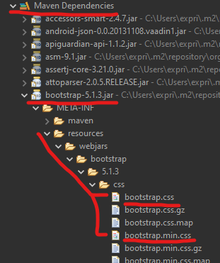
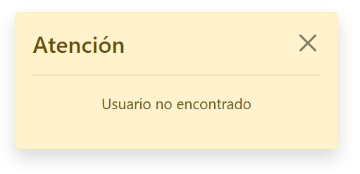
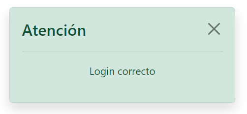

# Índice

[TOC]

------

# Bootstrap

**Bootstrap** es una biblioteca multiplataforma o conjunto de herramientas de código abierto para diseño de sitios y aplicaciones web. Contiene plantillas de diseño con tipografía, formularios, botones, cuadros, menús de navegación y otros elementos de diseño basado en HTML y CSS, así como extensiones de JavaScript adicionales. A diferencia de muchos frameworks web, solo se ocupa del desarrollo front-end. 


Aunque para las vistas usemos Thymeleaf, no dejan de ser archivos HTML , con las mismas etiquetas y atributos, por lo que podemos incluir Bootstrap de forma manual en cada archivo HTML como lo haríamos en cualquier proyecto web que use HTML.

Podemos usar cualquiera de los procedimientos indicados en su página web oficial [getbootstrap.com](https://getbootstrap.com). La manera más fácil es añadir los enlaces a los CDN externos dentro de la etiqueta `<head>` para el css, y al final del `<body>` para el JavaScript.

## Usando CDN

```html
<!-- CSS only -->
<link href="https://cdn.jsdelivr.net/npm/bootstrap@5.1.3/dist/css/bootstrap.min.css" rel="stylesheet" integrity="sha384-1BmE4kWBq78iYhFldvKuhfTAU6auU8tT94WrHftjDbrCEXSU1oBoqyl2QvZ6jIW3" crossorigin="anonymous"/>
```


```html
<!-- JavaScript Bundle with Popper -->
<script src="https://cdn.jsdelivr.net/npm/bootstrap@5.1.3/dist/js/bootstrap.bundle.min.js" integrity="sha384-ka7Sk0Gln4gmtz2MlQnikT1wXgYsOg+OMhuP+IlRH9sENBO0LRn5q+8nbTov4+1p" crossorigin="anonymous"></script>
```

Así tendríamos las librerías enlazadas externamente y habría que indicarlo plantilla por plantilla. Si quisiéramos actualizar la versión de Bootstrap, deberíamos modificar uno a uno los archivos HTML.

## Usando Maven con WebJars

Se pueden añadir librerías comunes como Bootstrap, JQuery, etc, desde Maven y después enlazarlas desde HTML. Esto nos facilitaría la descarga local de la librería completa y posterior enlace. Sería una alternativa a usar un CDN externo. La ventaja es que no dependemos CDN con un servidor externo y además STS4 si autocompleta las clases de CSS cuando son locales.

También puede ser útil cuando la tipología de la aplicación no nos permita enlazar con recursos externos y necesitemos todas las librerías de forma local. Ahí nos facilitará mucho el trabajo de descargarlo manualmente, descomprimir, etc.

1. Primero buscamos en el repositorio de Maven la librería que queramos  https://mvnrepository.com/.
2. Las de Bootstrap están en https://mvnrepository.com/artifact/org.webjars/bootstrap/latest. Con el sufijo `latest` en la url siempre tendremos las últimas estables. Podemos seleccionar la versión que queramos si [vamos a esta url](https://mvnrepository.com/artifact/org.webjars/bootstrap).
3. Copiamos su trozo de xml y lo pegamos en el `pom.xml` en la sección de `<dependencies>`. Actualizamos maven.
4. Y ya podemos enlazar desde HTML, usando la etiqueta `th:href`, examinando en las librerías la ruta correcta al archivo externo.

```html
<link th:rel="stylesheet" th:href="@{/webjars/bootstrap/5.1.3/css/bootstrap.min.css} "/>
<script th:src="@{/webjars/bootstrap/5.1.3/js/bootstrap.bundle.min.js"></script>
```

> **Nota:** Deberemos inspeccionar las librerías para encontrar la ruta correcta. Pueden cambiar de una versión a otra.
>
> 


## Usando Thymeleaf

También podemos extraer el trozo de página HTML y repetirlo cuantas veces queramos. Esto es muy útil para tener una única etiqueta `<link>` con la versión que queramos usar en nuestra aplicación e insertarla en todas las páginas de nuestra aplicación. Si actualizamos Bootstrap (o cualquier otra librería) sólo tendríamos que hacerlo en un archivo, el cual se insertaría (o reemplazaría) en la ubicación que deseemos.

Esto no es exclusivamente para añadir Bootstrap, podemos usarlo para menús de navegación, cabeceras, pie de páginas, secciones que se repitan, etc. 

Lo veremos en el siguiente apartado para diferenciarlo de Bootstrap, ya que es algo general de las plantillas Thymeleaf, aunque podemos usarlo también para incluir Bootstrap en nuestras plantillas.

# Fragmentos

## Creación de fragmentos con `th:fragments`

Los **fragmentos** en Thymeleaf son bloques de código que podemos definir para reutilizarlos en distintas páginas de nuestras aplicaciones. Los fragmentos se pueden definir en ficheros separados o agrupar varios fragmentos dentro de un mismo archivo y referenciarlos por separado, para tenerlos como una plantilla.

**¿Qué es un fragment?**

Vamos a suponer el siguiente trozo de código, que nos ha quedado tan bonito que queremos usarlo en toda la aplicación. Pero no tan bonito como para no querer modificarlo más o añadirle posibles enlaces a redes sociales, por ejemplo.

```html
<footer class="fixed-bottom bg-dark text-light p-3">
    <div class="float-end small">Copyleft Salva'21-22</div>
</footer>
```

**Para crear un fragmento tenemos dos opciones:**

1. Crear un archivo aparte llamado `pie-pagina.html`, sólo con el contenido y definición del fragmento, usando `th:fragment`

   ```html
   <footer th:fragment="pie-pagina" class="fixed-bottom bg-dark text-light p-3">
       <div class="float-end small">Copyright by Salva'21</div>
   </footer>
   ```

2. O bien crear un archivo aparte llamado `plantillas.html`, con toda la estructura HTML, y con el o los fragmentos que vayamos a compartir en la aplicación.

   ```html
   <!DOCTYPE html>
   <html lang="es" xmlns:th="http://www.thymeleaf.org">
   <head>
   	<title>Fragmentos</title>
       <meta charset="UTF-8" />
       <link href="https://cdn.jsdelivr.net/npm/bootstrap@5.1.3/dist/css/bootstrap.min.css" rel="stylesheet"/>
   </head>
   <body>
       <header th:fragment="cabecera" ...>
           ...
       </header>
   
       <nav th:fragment="navegacion" ...>
           ....
       </nav>
   
       <footer th:fragment="pie-pagina" class="fixed-bottom bg-dark text-light p-3">
           <div class="float-end small">Copyright by Salva'21</div>
       </footer>
   </body>
   
   </html>
   ```

La primera forma es más simple y concisa. Con la segunda forma tenemos la posibilidad de usar las **plantillas naturales** y ver  directamente el resultado de los fragmentos en cualquier navegador sin necesidad de procesar la plantilla en un servidor. Realmente el resto del contenido HTML que no sean los fragmentos no se usará nunca.

Ya que hemos visto como definirlos, veamos como aplicarlos.


## Uso de `th:replace` y `th:insert`

Thymeleaf puede incluir fragmentos previamente definidos como nuevas partes en sus páginas. Para ello usaremos **`th:replace`** y **`th:insert`**.

Ambos atributos son muy parecidos y se usan de forma similar. Se diferencian en lo siguiente:

- `th:insert` -> **Insertará** el fragmento especificado DENTRO de la etiqueta que tenga `th:insert`, como si fuese una etiqueta hija. Se insertará la etiqueta fragment en el interior de la etiqueta host.
- `th:replace` -> **Reemplazará** el fragmento especificado por el indicado en `th:replace`. Se eliminará la etiqueta host por la etiqueta fragment.

La sintaxis sería la siguiente:

```html
<etiqueta th:insert="ruta/archivo :: nombre-fragment"></etiqueta>
<etiqueta th:replace="ruta/archivo :: nombre-fragment"></etiqueta>
```

Con **`th:insert`** se **inserta** el fragmento llamado `nombre-fragment`, ubicado en la carpeta `/ruta` con el nombre de `archivo.html`. Se insertaría el fragmento DENTRO del contenido de `<etiqueta>`, eliminado su contenido original.

Con **`th:replace`**, **reemplaza** la `<etiqueta>` y su contenido, por el fragmento llamado `nombre-fragment`, ubicado en la carpeta `/ruta` con el nombre de `archivo.html`. Se borraría el contenido original de `<etiqueta>`.

Por ejemplo, veamos como insertar el fragmento definido anteriormente como `pie-pagina` en una página. El fragmento puede haber sido definido de cualquiera de las formas que hemos visto antes. El archivo externo lo hemos ubicado en `/fragmentos/pie.html`. Y su definición era `pie-pagina`.

```html
<footer th:replace="fragmentos/pie :: pie-pagina"></footer>
```

De estar forma, un `<footer>` sería reemplazado por el otro situado en el archivo externo, definido previamente como un fragmento.

Si quisiéramos incluir un `<link>` de bootstrap en la etiqueta `<head>` podríamos usar el `th:insert`.

**Definimos el fragmento primero**, en un archivo llamado `/fragmentos/link-bootstrap.html`.

```html
<!-- Fragmento en fragmentos/link-bootstrap.html -->
<link th:fragment="bootstrap" th:rel="stylesheet" th:href="@{/webjars/bootstrap/5.1.3/css/bootstrap.min.css} " />
```

**Usamos el fragment después**, en la página que queramos:

```html
<!DOCTYPE html>
<html lang="es" xmlns:th="http://www.thymeleaf.org">
<head th:insert="fragmentos/link-bootstrap :: bootstrap">
	<title>Home Page</title>
	<meta charset="UTF-8" />
</head>
<body>
    ...
</body>
</html>
```

> **MUY IMPORTANTE:** Al usar `th:insert`, estaríamos eliminando TODO lo que ya hubiera en la etiqueta `<head>`, por lo que se borrarían el `<title>` y el `<meta>`. En este caso, **sería recomendable** usar `th:replace` en su lugar. Con `<link th:replace="fragmentos/link-bootstrap :: bootstrap"/>`, o bien hacer un fragment con todo el `<head>` completo.

## Paso de parámetros a los fragments

Los fragmentos pueden recibir parámetros para que estos actúen de forma distinta cada vez que sean insertados, como los argumentos de una función cuando son llamadas.

**Definición del fragment**

```html
<!-- /fragmentos/mensaje.html -->
<div th:fragment="alerta( texto, color)" th:class="'shadow alert alert-' + ${color}">
	<h4>
		<span>Atención</span>
		<a href="#" class="btn btn-close float-end"></a>
	</h4>
	<hr />
	<p class="text-center small" th:text="${texto}"></p>
</div>
```

**Llamada al fragment**

```html
<div class="m-5" th:insert="fragmentos/mensaje :: alerta(texto='Usuario no encontrado', color='warning')">
</div>
```

**Código obtenido al procesar la plantilla**

```html
<div class="m-5">
    <div class="shadow alert alert-warning">
        <h4>
            <span>Atención</span>
            <a href="#" class="btn btn-close float-end"></a>
        </h4>
        <hr />
        <p class="text-center small">Usuario no encontrado</p>
	</div>
</div>
```

**Vista previa**




Tan sólo tendríamos que enviarle otros valores para obtener otro resultado:

**Llamada al fragment**

```html
<div class="m-5" th:insert="fragmentos/mensaje :: alerta(texto='Login correcto', color='success')">
</div>
```

**Vista previa**




💡Fíjate que en la definición del fragment hemos usado el atributo `th:class` de la siguiente forma:

```html
<etiqueta th:class="'shadow alert alert-' + ${color}"></etiqueta>
```

Hemos tenido que incluir la primera parte del contenido entre comillas simples `shadow alert alert-`, ya que todo es una expresión, y así concatenaríamos ambos Strings. La primera parte que es un literal, con la segunda que es una variable `'shadow alert alert-'` + `${color}`.

Se podría usar también las sustituciones literales de texto, funcionando igual que los template strings de JavaScript. Así simplificamos las expresiones cuando tenemos que concatenar varios strings.

```html
<etiqueta th:class="|shadow alert alert-${color}|"></etiqueta>
```

