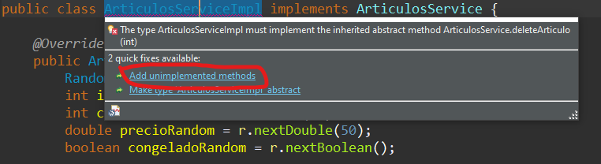
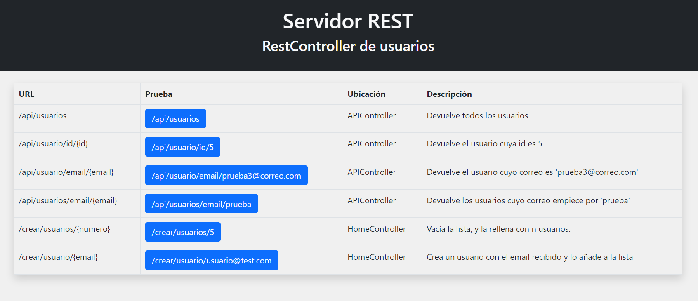
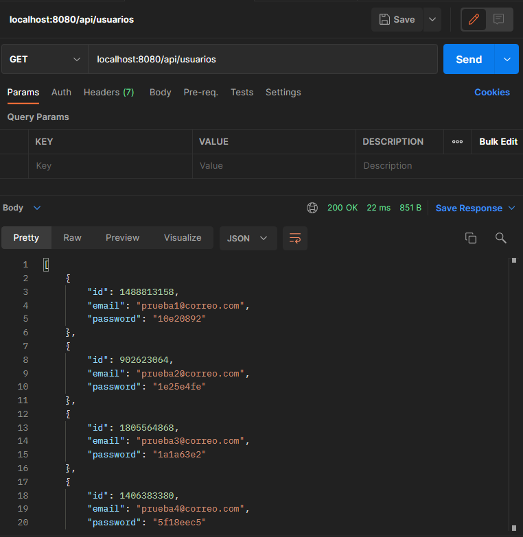
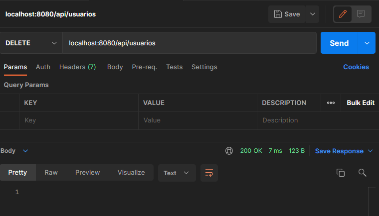
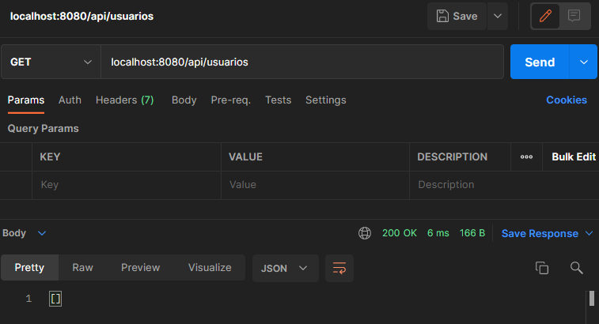
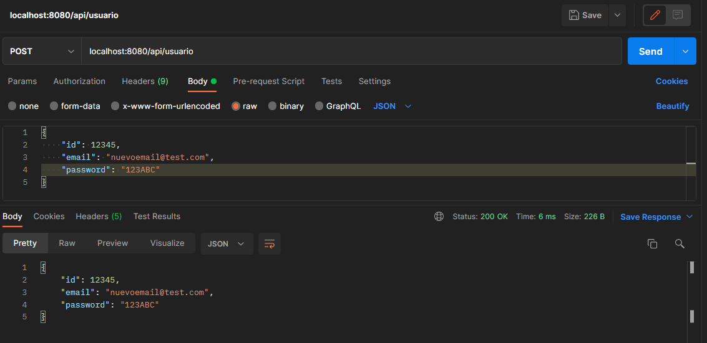

# Índice

[TOC]

------


# Servicios

## ¿Qué es un servicio?

Los servicios dentro de una aplicación son clases normales, que se usan para separar la lógica de negocio de nuestra aplicación en una capa distinta, separado estos procesos del controlador o de la capa de datos. Así estamos facilitando separando responsabilidades, mejorando la escalabilidad y facilitando la detección de errores. 

La idea es que **la lógica de negocio la hagan los servicios**, y los **controladores consuman el servicio**. Esto es que serán los encargados de hacer las llamadas a los métodos de la clase servicio.

Podríamos hacer toda la lógica de, por ejemplo, conectarnos con la base de datos, extraer la información y llevarla hasta la vista, todo en el controlador. Sería mejor separar toda esa lógica en una clase normal a la llamaremos servicio y que tendrá tantos métodos como trabajos queramos que realicen. De esta forma también estamos encapsulando el trabajo realizado, abstrayéndonos del CÓMO ha sido realizado. 

Una cocina sería un servicio. El camarero le pide a la cocina un plato de comida de una determinada forma, la cocina se lo devuelve y el camarero tiene lo que ha pedido. El camarero no tiene que preocuparse del procedimiento que se realizó para obtener el plato. Lo pide y se lo dan. Y ya lo puede servir, o hacer lo que quiera con él.

Un patrón de diseño que se suele usar para crear servicios es el **patrón fachada** (*facade*). Consiste en crear una interfaz con los métodos que queremos que tenga el servicio, y después crear una clase que implemente dicha interfaz. Así nos aseguraremos que el servicio tenga obligatoriamente todos los métodos que se han definido en la interfaz. Esto también permite crear especificaciones y que un mismo servicio pueda implementar varias interfaces, lo cual flexibiliza las opciones. Ejemplo: Podemos tener una interfaz que tenga métodos sólo disponibles para un rol concreto, y un servicio podría implementar interfaces de rol usuario y de rol administrador, teniendo los métodos por separado.

## Creando un servicio

Veamos un servicio creado usando dicho patrón.

**Diseño de la interfaz del ArticulosService**

```java
public interface ArticulosService {
	public Articulo getArticuloAleatorio();
	public Articulo getArticuloById(Integer id);
	public List<Articulo> getArticulos(int numero);
	public List<Articulo> getArticulosBy(String descripcion);
}
```

**Implementación de la interfaz**

```java
public class ArticulosServiceImpl implements ArticulosService {
	
	@Override
	public Articulo getArticuloAleatorio() {
		Random r = new Random();
		int id = Math.abs(r.nextInt());
		int cantidadRandom = r.nextInt(10)+1;
		double precioRandom = r.nextDouble(50);
		boolean congeladoRandom = r.nextBoolean();
		
		return new Articulo(id, cantidadRandom, "Artículo nº" + id, precioRandom, congeladoRandom);
	}

	@Override
	public Articulo getArticuloById(Integer id) {
		//Generamos uno al azar y le ponemos la id recibida
		Articulo articuloCreado = this.getArticuloAleatorio();
		articuloCreado.setId(id); 
		articuloCreado.setDescripcion("Artículo nº" + id);
		
		return articuloCreado;
	}
	
	@Override
	public List<Articulo> getArticulos(int numero) {
		//Generamos una lista con tantos artículos nos hayan pedido
		List<Articulo> lista = new ArrayList<Articulo>();
		for (int i=0; i<=numero-1; i++) {
			lista.add(this.getArticuloAleatorio());
		}
		return lista;
	}

	@Override
	public List<Articulo> getArticulosByDescripcion(String descripcion) {
		// TODO Auto-generated method stub
		return null;
	}
}
```

Vemos como al **implementar** la interfaz `ArticulosService`, Java nos obliga a sobrescribir los métodos abstractos heredados, teniendo que desarrollar lo que hace cada uno. El último método `.getArticulosByDescripcion()` lo hemos dejado intacto tal cual nos lo deja el IDE, y ya lo implementaremos cuando nos haga falta.

Ahora mismo el servicio de artículos, no los está recuperando de una base de datos, los está creando aleatoriamente. Pero al tener toda la lógica de negocio separada por capas, en el momento que usemos el servicio que REALMENTE SI devuelva los artículos obtenidos de una base de datos, los controladores seguirán funcionando exactamente igual, ya que se limitan a hacer llamadas a los servicios, uno falso como ahora (*mock*), o reales (más adelante).

## Añadir funcionalidades al servicio

Si queremos añadir funcionalidades al servicio, habría que añadirle un nuevo método abstracto a la interfaz `ArticulosService`

```java
public interface ArticulosService {
	...
	public boolean deleteArticulo(int id); //Añadimos un nuevo método para borrar un artículo
}
```

Y automáticamente el IDE nos pedirá que `ArticulosServiceImpl` debe implementar ese método abstracto heredado. 

> 💡Recordemos que en java, todos los métodos definidos en una interfaz son implícitamente `public abstract`.



Al hacer clic en la opción de “*Add unimplemented methods*” nos heredará automáticamente los métodos nuevos, creando la estructura del mismo, y ahí es donde tendremos que desarrollar la implementación del nuevo método, programando la nueva funcionalidad. 

```java
public class ArticulosServiceImpl implements ArticulosService {

    ...
        
	@Override
	public boolean deleteArticulo(int id) {
		// TODO Auto-generated method stub
		return false;
	}
}
```

Nosotros decidimos como funcionan los métodos, lo argumentos que reciben, lo que hace en su interior y los valores que devuelven. Por ejemplo, aquí hemos decidido devolver un `boolean` que indicará si pudo borrar el artículo o no. Otra opción sería devolver una instancia del artículo borrado (para poder mostrar información del mismo) o un `null` en caso de que no hubiese sido posible borrar el artículo. 

## Servicios en Spring Boot

Ya que sabemos que es un servicio, como crearlos y usarlos en cualquier aplicación JavaEE, veremos como integrarlos en una aplicación con Spring Boot.

Spring nos facilita el uso de los servicios con la anotación **`@Service`**. Así le estamos diciendo a Spring que la clase va a poder ser inyectada. 

```java
@Service
public class ArticulosServiceImpl implements ArticulosService {
	...
}
```

Ahora necesitamos en el controlador donde usemos el servicio, una instancia del objeto de la clase `ArticulosServiceImpl` y se hace usando la inyección de dependencias. Usando la anotación **`@Autowired`** sobre la **interfaz** `ArticulosService`, Spring inyectará un objeto que implemente dicha interfaz. 

```java
@Controller
@RequestMapping("/api")
public class APIController {
	
	@Autowired
	private ArticulosService articuloService;
	
	@GetMapping("/articulo/{id}")
	public String getArticuloPorId(
			@PathVariable Integer id,
			Model model
			) {
		Articulo a = articuloService.getArticuloById(id);
		model.addAttribute("listaArticulos", a);
		return "ficha-articulo";	
	}
    ...
}	
```

Ya podemos usar de una forma simple y eficiente los servicios de `ArticuloService` en todos los métodos del controlador, sin tener que inyectarlo método por método.

⚠**Atención:** Un “error” muy común es querer inyectar un objeto de la clase con la implementación de la interfaz . Hay que **inyectar la interfaz del servicio**, y Spring hará todo el trabajo de crear una única instancia del objeto que implementa esa interfaz. En nuestro ejemplo lo correcto sería inyectar `ArticulosService`, y no `ArticulosServiceImpl`. De hecho, funcionará de ambas maneras, pero es una buena práctica codificar las interfaces en general, por el mismo motivo por el que se hace `List<Articulo> lista = new ArrayList<Articulo>()`.

> 🤓Técnicamente, el alcance de todas las anotaciones de Spring (`@Service`, `@Controller`, etc.) es un *Singleton*. Eso es otro patrón de diseño que consiste en crear una única instancia del objeto, que es la que se inyecta. De forma que no estamos creando múltiples instancias del mismo objeto en cada método.

# REST

## ¿Qué es REST?

REST es un acrónimo de ***RE**presentational **S**tate **T**ransfer*. En pocas palabras, si HTTP es transferencia de archivos, REST se basa en transferencia de recursos. Aunque ambos siguen usando el mismo protocolo, el HTTP, lo que cambia es la respuesta ofrecida.

Mientras que una respuesta HTTP estándar, es texto que crea otra página web que representa el navegador, una respuesta REST tiene el formato de un archivo XML o JSON. Se usan principalmente para el intercambio de datos, de una manera ligera y legible.

Es una forma de separar el cliente del servidor y hacer esa separación de forma independiente de la plataforma y tecnología usadas. Por ejemplo, podemos tener el backend en Java usando Spring y emitir las respuestas en JSON, de forma que el frontend en Angular haga las peticiones al backend e interprete esas respuestas en JSON. Si el día de mañana cambiamos de Angular a React o bien, el backend lo cambiamos a PHP, todo seguirá funcionando igual, siempre el API REST siga funcionando bajo las mismas rutas y devolviendo los objetos con la misma estructura. 

## REST en Spring Boot

Podemos construir sin mucho esfuerzo un controlador REST en Spring Boot, de forma que una petición a una URL nos devuelva casi de forma automática una respuesta en formato JSON:

**Ejemplo**: Una petición a http://localhost:8080/proyecto/api/articulos, en lugar de redireccionar a una vista con Thymeleaf, podemos emitir una respuesta con la lista completa de artículos que tengamos en nuestra base de datos:

```json
[
    {
        "id": 1,
        "cantidad": 9,
        "descripcion": "Bolsa Patatas Prefritas 1kg",
        "precio": 0.79,
        "congelado": true
    },
    {
        "id": 2,
        "cantidad": 5,
        "descripcion": "Garbanzos precocidos 500ml",
        "precio": 0.80,
        "congelado": false
    },
    {
        "id": 3,
        "cantidad": 9,
        "descripcion": "Leche en polvo 1l",
        "precio": 1.00,
        "congelado": false
    },
    {
        "id": 4,
        "cantidad" : 3,
        "descripcion": "Pollo asado 700gr",
        "precio": 4.30,
        "congelado": false
    },
    {
        "id": 5,
        "cantidad": 2,
        "descripcion": "Nuggets de pollo 500gr",
        "precio": 2.50,
        "congelado": true
    }
]
```

>💡Para que la conversión no de errores, el objeto a convertir deberá ser un bean (tener un constructor por defecto, tener todos los *getters* y *setters* públicos bien construidos, etc.)

Vamos a ver todas la anotaciones que debemos usar para crear un controlador REST con muy poco código.

## Clase Articulo

En los siguientes ejemplos, usaremos la siguiente clase **Articulo.java**, por lo que exponemos el código completo.

```java
public class Articulo {
	//Atributos
	private long id;
	private int cantidad;
	private String descripcion;
	private double precio;
	private boolean congelado;
	
	//Constructores
	public Articulo() {}

	public Articulo(long id, int cantidad, String descripcion, double precio, boolean congelado) {
		super();
		this.id = id;
		this.cantidad = cantidad;
		this.descripcion = descripcion;
		this.precio = precio;
		this.congelado = congelado;
    }
    
    public Articulo(int cantidad, String descripcion, double precio) {
		super();
		this.id = 0;
		this.cantidad = cantidad;
		this.descripcion = descripcion;
		this.precio = precio;
		this.congelado = false;
	}

	//Métodos
	public long getId() {
		return id;
	}

	public void setId(long id) {
		this.id = id;
	}
	
	public int getCantidad() {
		return cantidad;
	}

	public void setCantidad(int cantidad) {
		this.cantidad = cantidad;
	}

	public String getDescripcion() {
		return descripcion;
	}

	public void setDescripcion(String descripcion) {
		this.descripcion = descripcion;
	}

	public double getPrecio() {
		return precio;
	}

	public void setPrecio(double precio) {
		this.precio = precio;
	}

	public boolean isCongelado() {
		return congelado;
	}

	public void setCongelado(boolean requiereFrio) {
		this.congelado = requiereFrio;
	}

	@Override
	public String toString() {
		return "Articulo [id=" + id + 
				", cantidad=" + cantidad + 
				", descripcion=" + descripcion + 
				", precio=" + precio + 
				", congelado=" + congelado + 
				"]";
	}
}
```

## Lombok

>🧪**Nota:** La documentación de Lombok de este tutorial es experimental. No está testeada. Usar con precaución.

Lombok es una librería que posee muchas anotaciones que nos ahorra trabajos repetitivos de muchos tipos.

Para añadir la librería, añadiremos las siguientes líneas al `pom.xml` de Maven.

```xml
<!-- https://projectlombok.org/setup/maven -->
<dependency>
    <groupId>org.projectlombok</groupId>
    <artifactId>lombok</artifactId>
    <version>1.18.22</version>
    <scope>provided</scope>
</dependency>
```

Una vez actualizadas las dependencias y descargadas las librerías, ya podemos usar todas sus anotaciones.

Las más usadas son:

- `@Getter` y `@Setter`, nos ahorramos tener que crear los métodos getters y setters respectivamente, de cada atributo.
- `@ToString` en la clase, nos creará el método `toString()`.
- `@EqualsAndHashCode`, nos creará ambos métodos a la vez.
- `@NoArgsConstructor`, creará un constructor por defecto (que no recibe parámetros).
- `@AllArgsConstructor`, creará un constructor que recibe todos los valores de los atributos por parámetros.
- `@Data`, es un anotación que incluye las ventajas de `@ToString`, `@EqualsAndHashCode`, `@Getter` / `@Setter` y `@RequiredArgsConstructor`. En otras palabras, genera todo el código repetitivo que normalmente se hace en todos los POJOS y Beans, sin tener que usar todas las anotaciones una por una.
- La lista completa la puedes encontrar en su documentación oficial en la página https://projectlombok.org/features/all.

Usando todos las anotaciones anteriores, la clase Articulo creada anteriormente se podría quedar con el siguiente código:

```java
@AllArgsConstructor
@NoArgsConstructor
@ToString @EqualsAndHashCode
public class Articulo {
	@Getter @Setter
	private long id;
	@Getter @Setter
	private int cantidad;
	@Getter @Setter
    private String descripcion;
	@Getter @Setter
    private double precio;
	@Getter @Setter
    private boolean congelado;
	
    public Articulo(int cantidad, String descripcion, double precio) {
		super();
		this.id = 0;
		this.cantidad = cantidad;
		this.descripcion = descripcion;
		this.precio = precio;
		this.congelado = false;
	}
}
```

✨De 80 líneas ha pasado a 24. Y se podrían quedar en menos usando la anotación `@Data`.

💡Podéis encontrar más información en https://javatodev.com/lombok-spring-boot/.


## @ResponseBody

La anotación `@ResponseBody` le indica a un controlador que el objeto que retornemos se debe convertir automáticamente en JSON y eso será lo que se envíe como respuesta, en lugar de ir a una vista con Thymeleaf.

```java
@Controller
@RequestMapping("/api")
public class APIController {
	@Autowired
	ArticulosService articulosService;

    ...
        
   	@ResponseBody
	@GetMapping("/articulo/{id}")
	public Articulo getArticulo(@PathVariable Integer id) {
		return articulosService.getArticuloById(id);
	}
}
```

Tenemos un controlador `APIController`, que será el encargado de recibir todas las peticiones REST. Destacamos:

- Le inyectamos el servicio `ArticulosService`, que será el encargado de usar la lógica de negocio para obtener la información que se le pide (obtener artículos por id, por precio, por descripción, todos los artículos, etc.)
- Con la anotación `@ResponseBody` le indicamos al controlador que no vamos a redireccionar a una vista HTML, si no que lo que vamos a devolver es un objeto, el cual será convertido a JSON por Spring Boot. Por eso tenemos que indicar en la firma del método la clase del objeto que vamos a retornar.
- El método `.getArticulo()` será llamado cada vez que realicemos una consulta a `/api/articulo/{id}`, donde `{id}` es la id del artículo a consultar. El servicio llamará al método que ya tiene para tal fin `articulosService.getArticuloById()`, el cual retornará el artículo cuya id sea {id} o bien `null` si esa id no se encuentra.

Obtendríamos la siguiente respuesta en JSON al hacer la petición GET a la URL `/api/articulo/3`

```json
{
    "id": 3,
    "cantidad": 9,
    "descripcion": "Leche en polvo 1l",
    "precio": 1.00,
    "congelado": false
}
```

Con esa petición obtendremos UN único artículo. Si queremos obtener un array de artículos, tan sólo deberemos retornar una colección de objetos y Spring Boot hará el trabajo de conversión a JSON.

```java
@ResponseBody
@GetMapping("/articulos")
public List<Articulo> getArticulos() {
    return articulosService.getAllArticulos();	
}
```

```json
[
    {
        "id": 1,
        "cantidad": 9,
        "descripcion": "Bolsa Patatas Prefritas 1kg",
        "precio": 0.79,
        "congelado": true
    },
    {
        "id": 2,
        "cantidad": 5,
        "descripcion": "Garbanzos precocidos 500ml",
        "precio": 0.80,
        "congelado": false
    },
    {...},
    {...}
]
```


## @RestController

Hemos visto que para hacer que los métodos de un controlador devuelvan objetos JSON, debemos usar `@ResponseBody`. Por otro lado, es muy frecuente que todos los métodos que devuelvan JSON estén agrupados en un mismo controlador, por lo que hay una anotación que se usa como combinación de `@Controller`  + `@ResponseBody`, y es **`@RestController`**.

Si usamos la anotación especializada `@RestController` en lugar de `@Controller`, le estamos diciendo explícitamente que TODOS los métodos de ese controlador devolverán JSON, por lo que no es necesario indicarle `@ResponseBody`.

```java
@RestController
@RequestMapping("/api")
public class APIController {
    ...
        
	@GetMapping("/articulo/{id}")
	public Articulo getArticulo(@PathVariable Integer id) {
		return articulosService.getArticuloById(id);
	}
}
```


------

## Práctica 6

Hacer un proyecto Spring Boot, con un REST de usuarios funcional como el siguiente. El servicio será un mock que actuará sobre una colección.



En https://github.com/borilio/curso-spring-boot/tree/master/assets/clases/practica-6 encontrarás los siguientes recursos para reutilizar:

**Lo que ya está hecho:**

- `vistas/home.html` -> Es la página principal de la aplicación (la captura de arriba). En ella se encuentran las url que debemos satisfacer en nuestro Rest Controller y la descripción de lo que debe hacer cada una.
- `controllers/HomeController.java` -> El controlador principal que nos lleva a `home.html`. Ya encontrarás definidos e implementados en su interior formas para crear usuarios manualmente.
- `users/User.java` -> Una clase POJO que representa un usuario. Examina los constructores que tiene.
- `users/UserService.java` -> La interfaz `UserService` donde están definidos los métodos que deberemos desarrollar en `UserServiceImpl`.
- ⚠**Aviso:** En los archivos proporcionados, deberás cambiar el nombre del paquete por el definido en tu proyecto.

**Lo que hay que hacer:**

1. Primero deberemos completar el servicio. En orden haremos:
   1. Creamos en el paquete `users`, una clase llamada `UserServiceImpl`.
   2. Convertimos la clase en un servicio, usando la anotación correspondiente.
   3. La clase tendrá un sólo atributo privado, `private List<User> listaUsuarios;`. En el constructor de la clase inicializaremos ese atributo a un nuevo `ArrayList<User>` vacío.
   4. La clase implementará la interfaz `UserService`, sobrescribiendo todos los métodos abstractos heredados por la interfaz.
   5. Cada método heredado actuará sobre el atributo de la clase `listaUsuarios`, como si de una base de datos se tratara. De forma que nuestro servicio “imitará” el funcionamiento de una base de datos. Desde fuera del servicio, parecerá que está tratando internamente con una base de datos.
   6. En `UserService`, cada método tiene un comentario explicando lo que debería hacer cada método del servicio. Esto deberá implementarse en `UserServiceImpl`. Son acciones simples, entre 1 y 4 líneas cada uno como máximo. Si tenéis dudas en alguna preguntar y se aclarará.
2. Crear el controlador `APIController`. Aquí es donde se definirán las url que se pueden ver en `home.html` (o en la captura).
   1. Usar las anotaciones oportunas para crear un REST.
   2. Inyectar el servicio.
   3. Hacer los 4 métodos necesarios para satisfacer las necesidades del API definidas, haciendo uso del servicio `UserService`.
3. Comprobar que todo lo indicado en `home.html` funciona.

💡Verás que haciendo uso del servicio, las acciones para interactuar con la “base de datos” se resumen a UNA LINEA DE CÓDIGO. Y lo mejor es que este servicio *mock*, puede ser fácilmente sustituido por uno real que sí acceda a una base de datos real, dejando el código del controlador intacto.

# Métodos de petición HTTP

En la práctica anterior, no hemos borrado nada de nuestra “base de datos” falsa, a pesar de tener un método en el servicio.

```java
public interface UserService {
	...
    //Limpia todo el contenido de la lista de usuarios, dejándola vacía
	public void deleteAll();
}
```

Su implementación era simple, era limpiar el ArrayList.

```java
@Override
public void deleteAll() {
    this.listaUsuarios.clear();
}
```

Podríamos haber añadido una acción más, que por ejemplo al ir a GetMapping de `/borrar/usuarios`, hacer una llamada al método del servicio y se borraba la lista completa. TODO lo hacemos con `GET`.

Pero las peticiones de tipo `GET` deberían usarse sólo para recuperar datos. Veamos los métodos más comunes de HTTP y sus aplicaciones (hay más, pero mostraremos los básicos).

## GET

El método `GET` solicita una representación de un recurso específico. Las peticiones que usan el método `GET` sólo deben recuperar datos.

```http
GET localhost:8080/api/usuarios
```

## POST

El método `POST` se utiliza para enviar una entidad a un recurso específico. Aunque se pueda usar `GET` para enviar datos, tiene muchas limitaciones que `POST` no tiene. Su fin es más genérico, envía información para que quién la reciba haga lo que estime con ella. `POST` no es idempotente. Una nueva petición POST tendría  un efecto distinto que la primera llamada (por ejemplo, dos peticiones seguidas insertarían 2 usuarios en la base de datos).

```http
POST localhost:8080/api/usuario/user
```

El backend crearía un nuevo objeto `user` y le asignaría una id, creando el objeto `/api/usuario/123`. Por eso cada llamada puede tener efectos distintos. Otra llamada crearía otro usuario con otra id distinta, creando otro recurso `/api/usuario/124`.

## PUT

El modo `PUT` reemplaza todas las representaciones actuales del recurso de destino con la carga útil de la petición. Se suele usar para actualizar contenidos o bien para crear nuevos. Pone un contenido en un recurso, si no existe lo crea, y si existe lo reemplaza. `PUT` es idempotente, es decir, siempre tendrá el mismo resultado cuantas veces se realice la petición.

```http
PUT localhost:8080/api/usuario/5
```

Se actualizará el recurso indicado con la información que lleve en la petición, o se creará uno nuevo. Si repetimos la petición, se volvería a realizar, pero dejándolo en el mismo estado. No duplicaría nada.

## DELETE

El método `DELETE` borra un recurso en específico.

```http
DELETE localhost:8080/api/usuario/5
```

Borraría el recurso (usuario) cuya id sea 5.

## PATCH

El método `PATCH` es utilizado para aplicar modificaciones parciales a un recurso. A diferencia de `PUT` que lo reemplaza (o crea) completamente.

```http
PATCH localhost:8080/api/usuario/5
```

En la petición iría sólo la información que queremos modificar en el recurso. La que no se incluya se dejará como estaba.

------

Fuente: [Mozilla Developer. Métodos de petición HTTP](https://developer.mozilla.org/es/docs/Web/HTTP/Methods)


## Usando los métodos HTTP en Spring Boot

Ya hemos visto que hay más métodos/verbos en las peticiones HTTP. Veamos como se aplicarían correctamente en la práctica anterior.

### @DeleteMapping

Para hacer una petición que borre un recurso, en lugar de hacerlo mediante el método `GET`, lo correcto sería hacerlo con el método `DELETE`, y eso sería cambiando el método soportado en la petición a `/borrar/usuarios`

```java
@RestController
@RequestMapping("/api")
public class APIController {
	@Autowired
	UserService userService;
	
	@GetMapping("/usuarios")
	public List<User> getAllUsers(){
		return userService.getAll();
	}
	...	
	@DeleteMapping("/usuarios/")
	public void deleteAllUsers() {
		userService.deleteAll();
	}
}
```

Al soportar cada url métodos distintos, podemos usar las mismas url, facilitando la escalabilidad del api. 

Lo único que ahora para probar el método `.deleteAllUsers()` no podremos ir a la url `/api/usuarios` desde el navegador, ya que si no estaremos haciendo una petición de tipo `GET`, y ejecutaremos `.getAllUsers()`. 

La url será la misma, pero dependiendo del tipo de petición que hagamos, hará una cosa u otra. Para poder probar esto, podemos usar una aplicación tipo [postman](https://www.postman.com/downloads/) o extensiones del navegador.

Podemos ver que al hacer la petición de tipo `GET` a `/api/usuarios`, obtenemos como respuesta el JSON con todos los usuarios.



Sin embargo si hacemos una petición `DELETE` a la misma url, obtenemos lo siguiente:



No obtenemos cuerpo de respuesta, pero nos devolvió un código 200. Eso significa que no hubo errores. Se procesó la petición bien y nos dirigió al método correcto que borró la “base de datos” de usuarios.

Si repetimos la petición `GET` a `/api/usuarios` para asegurarnos, obtendremos lo siguiente:



Si decidimos crear un nuevo método al servicio para borrar UN usuario concreto, haríamos lo siguiente:

Añadimos el método al servicio `UserService`.

```java
public interface UserService {
	...
	//Borra el usuario cuya id sea igual a la recibida, devolviendo el User si lo borró, o null si no se encontró
	public User deleteById(int id);
	
}
```

Lo implementamos en `UserServiceImpl`.

```java
@Service
public class UserServiceImpl implements UserService {
	...
        
	@Override
	public User deleteById(int id) {
		User userBorrado = null;
		for (User u: this.listaUsuarios) {
			if (u.getId() == id) {
				userBorrado = u;
				listaUsuarios.remove(u);
			}
		}
		return userBorrado;
	}
}
```

Añadimos el método al `APIController`, usando el servicio anterior.

```java
@RestController
@RequestMapping("/api")
public class APIController {
	...
	
	@DeleteMapping("/usuario/{id}")
	public void deleteUserById(@PathVariable Integer id) {
		userService.deleteById(id);
	}
}
```

Si tenemos 3 usuarios en nuestra “base de datos”, y hacemos la siguiente petición, obtendremos la siguiente respuesta, respectivamente:

```http
GET localhost:8080/api/usuarios
```

```json
[
    {
        "id": 2114061879,
        "email": "prueba1@correo.com",
        "password": "7e5ddfb1"
    },
    {
        "id": 1610394191,
        "email": "prueba2@correo.com",
        "password": "4e31045"
    },
    {
        "id": 295829159,
        "email": "prueba3@correo.com",
        "password": "64857c0"
    }
]
```

Comprobamos que ahí está la base de datos completa. Hacemos nueva petición y respuesta.

````http
GET localhost:8080/api/usuario/id/1610394191
````

```json
{
    "id": 1610394191,
    "email": "prueba2@correo.com",
    "password": "4e31045"
}
```

Y si en lugar de `GET`, usamos `DELETE`, se borrará ese usuario, en lugar de obtener su JSON.

```http
DELETE localhost:8080/api/usuario/id/1610394191
```

Comprobamos de nuevo la lista completa y obtenemos la respuesta:

```http
GET localhost:8080/api/usuarios
```

```json
[
    {
        "id": 2114061879,
        "email": "prueba1@correo.com",
        "password": "7e5ddfb1"
    },
    {
        "id": 295829159,
        "email": "prueba3@correo.com",
        "password": "64857c0"
    }
]
```

El usuario cuya id era `1610394191` fue borrado de la base de datos, usando su correspondiente `DELETE` como método HTTP, en lugar de `GET`.

### @PostMapping

Para borrar hemos visto que se puede o bien no recibir nada (si lo quiero borrar todo) o bien se puede recibir por `@PathVariable` la id del recurso a borrar. Pero para crear un nuevo recurso, ¿como podría enviar un objeto a través de la petición para que el controlador lo recoja y lo guarde en la base de datos?

Esto ahora mismo sabríamos hacerlo. Podríamos:

- Añadiendo en la petición `GET` los parámetros en la misma url. Ej: `/crear/usuario?id=5&email=nuevo@test.com&pass=12345`. Esto es muy engorroso, seguridad nula, y para objetos complejos sería prácticamente inviable.

- Con un formulario, por `GET` o `POST`, y recogiendo los parámetros con `@RequestParam` por separado en variables (`id`, `email` y `pass` siguiendo nuestro ejemplo), creando un nuevo objeto de la clase `User`, pasándole esas variables al constructor. Casi los mismos problemas que en la opción anterior.

**Una mejor solución es enviar el objeto en JSON por la petición** `POST` o `PUT`, y en Spring Boot hará el trabajo de convertir ese JSON a un Objeto Java directamente. 

Si cuando convertimos de Objeto a JSON para la respuesta, usamos la anotación `@ResponseBody`, ahora que estamos haciendo justo lo contrario, convertir JSON de la petición en un Objeto, la anotación que usaremos será **`@RequestBody`**.

En nuestro RestController `APIController`, le añadimos el siguiente método:

```java
@RestController
@RequestMapping("/api")
public class APIController {
	...
	@PostMapping("/usuario")
	public User nuevoUsuario(@RequestBody User usuarioNuevo) {
        return userService.add(usuarioNuevo);
	}
}
```

Y si con *postman* hacemos la petición de tipo `POST` y en el *body* le indicamos *raw* y a la derecha del todo, el formato JSON. Y escribimos directamente el JSON en el cuerpo de la petición, la url `/api/usuario` recibirá el JSON indicado y gracias al `@RequestBody`, Spring lo convertirá a un objeto `User` y gracias al servicio lo insertaremos en la “base de datos”. La petición nos devolverá el objeto que ha sido guardado. 



Y ahora comprobamos que el usuario ha sido guardado correctamente.

```http
GET localhost:8080/api/usuarios
```

```json
[
    {
        "id": 2114061879,
        "email": "prueba1@correo.com",
        "password": "7e5ddfb1"
    },
    {
        "id": 295829159,
        "email": "prueba3@correo.com",
        "password": "64857c0"
    },
    {
    	"id": 12345,
	    "email": "nuevoemail@test.com",
	    "password": "123ABC"
	}
]
```


### @PutMapping

Con todo lo que hemos visto anteriormente, ya sabemos que para actualizar un elemento concreto entero (o crear) usaremos `PUT`. 

Definimos el método en la interfaz y lo implementaremos: 

```java
public interface UserService {
	...
	public User update(User nuevo, int id);    
}
```

```java
@Service
public class UserServiceImpl implements UserService {
	...
	@Override
	public User update(User nuevo, int id) {
		User actualizado = null;
		for (User u: this.listaUsuarios) {
			if (u.getId() == id) {
				u.setEmail(nuevo.getEmail());
				u.setPassword(nuevo.getPassword());
				actualizado = u;
			}
		}
		return actualizado;
	}
}
```

Añadimos el método al `APIController`, usando el servicio anterior.

```java
@RestController
@RequestMapping("/api")
public class APIController {
	...
	
	@PutMapping("/usuario/{id}")
	public User updateUser(
			@PathVariable Integer id,
			@RequestBody User userUpdated
			) {
		return userService.update(userUpdated, id);
	}
}
```

Y haciendo la siguiente petición `PUT`, tendremos la respuesta (suponiendo que existe un usuario cuya id es `1545713824`):

```http
PUT /api/usuario/1545713824 HTTP/1.1
Host: localhost:8080
Content-Type: application/json

{
    "id": 1545713824,
    "email": "pruebados@correonuevo.com",
    "password": "12345Laclavequepondríaunestúpidoensusmaletas"
}
```

```json
{
    "id": 1545713824,
    "email": "pruebados@correonuevo.com",
    "password": "12345Laclavequepondríaunestúpidoensusmaletas"
}
```

### @PatchMapping

Sería exactamente igual que `PUT` pero con la diferencia de que podemos omitir los campos que no queremos que se modifiquen. Por ejemplo si sólo queremos modificar el email, pues en la petición sólo pondríamos:

```json
{
    "email": "pruebados@correonuevo.com"
}
```

Y el resto de atributos quedarían tal y como estaban.


# Conclusión

Usando los métodos adecuados de HTTP para las peticiones podemos conseguir que nuestros frontend y backend se comuniquen mediante objetos JSON, de forma bidireccional. **Así nos aseguramos que uno no dependa del otro** y que trabajen de forma independiente. 

El equipo de desarrollo de frontend puede usar un backend mock ( https://my-json-server.typicode.com, https://www.mockable.io, https://get.mocklab.io) y viceversa con Postman por ejemplo. 

Cuando ambos funcionen y ya estén funcionales y testeados, podrán integrarse fácilmente cambiando uno por otro y todo funcionará perfectamente a la primera 🤞.


