# Índice

[TOC]


# Introducción

Trabajar con una base de datos usando la forma estándar de JDBC en un proyecto web con Spring, se puede convertir en una ardua tarea, teniendo que escribir mucho código innecesario para tratar múltiples excepciones, abrir y cerrar conexiones, etc. Pero Spring Framework se encarga de realizar todos esos detalles a bajo nivel, tales como preparar y ejecutar instrucciones SQL, procesar las  excepciones, manejar las transacciones y finalmente cerrar la conexión.

Spring proporciona muchas formas diferentes de realizar la interfaz con la base de datos. Con Spring-JDBC, se nos ofrece una manera mucho más fácil de acceder a una base de datos y realizar consultas de selección y manipulación de datos, todo a través de la clase `JdbcTemplate`. Pero con los repositorios de JPA se reduce todo a un par de líneas. Pronto lo veremos.

# Spring Data 

Spring Data es un proyecto de SpringSource cuyo propósito es unificar y facilitar el acceso a distintos tipos de tecnologías de persistencia, tanto a bases de datos relacionales como a las del tipo NoSQL.

Spring ya proporcionaba soporte para JDBC, Hibernate, JPA, JDO o MyIbatis, simplificando la implementación de la capa de acceso a datos, unificando la configuración y creando una jerarquía de excepciones común para todas ellas.

Y ahora, Spring Data viene a cubrir el soporte necesario para distintas tecnologías de bases de datos NoSQL y, además, integra las tecnologías de acceso a datos tradicionales, simplificando el trabajo a la hora de crear las implementaciones concretas.

Veremos cómo integrar la persistencia JPA en un proyecto Spring Boot para simplificar más todavía el acceso a datos a través de los nuevos repositorios.

## Preparando el entorno

Antes de crear el proyecto con Spring Data, tendremos que tener preparada una base de datos en MySQL. Tan sólo deberemos abrir el servidor MySQL y crear una base de datos que será la que luego conectemos desde el proyecto Spring Boot.

1. Deberemos instalar un servidor MySQL. Podemos instalar [XAMPP](https://www.apachefriends.org/es/download.html) que en su página tiene versiones para Windows, Mac y Linux. Esto incluirá servidores Apache Tomcat, MariaDB (una versión OpenSource de MySQL, propiedad de Oracle), PHP y Perl. Sólo necesitaremos MySQL y Apache en el caso de que queremos usar PHPMyAdmin. En el tutorial usaremos XAMPP, pero se puede realizar todo con cualquier servidor MySQL. Si prefieres la versión gratis de MySQL Community de Oracle©, la podrás [encontrar aquí](https://dev.mysql.com/downloads/mysql/).
2. Una vez instalado, deberemos arrancar el servidor MySQL. En XAMPP es pulsar en `Start` junto a MySQL.
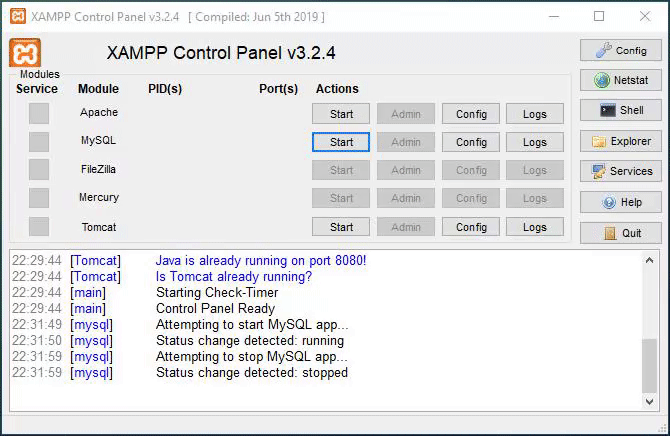
3. Si pulsamos en `Shell` se abrirá una ventana con una línea de comandos donde escribiremos lo siguiente para entrar (con la configuración predeterminada que viene en XAMPP). `-h` sirve para indicarle el host. `-u` el usuario y `-p` para que nos pida la contraseña. La contraseña está vacía por defecto, así que pulsaremos intro cuando nos pregunte. 
```bash
mysql -h localhost -u root -p
```
> **Nota:** Si tenemos el path configurado correctamente, funcionará desde cualquier ubicación que estemos en la línea de comandos. Si no tendremos que entrar en la ubicación del archivo mysql.exe, que suele estar en `~/xampp/mysql/bin/mysql.exe`. 
4. Una vez dentro del servidor, entraremos en OTRA consola de comandos, pero ahora la de MariaDB.

```
Setting environment for using XAMPP for Windows.
expri@DESKTOP-ASGARD c:\users\expri\xampp
# mysql -h localhost -u root -p
Enter password:
Welcome to the MariaDB monitor.  Commands end with ; or \g.
Your MariaDB connection id is 19
Server version: 10.4.13-MariaDB mariadb.org binary distribution

Copyright (c) 2000, 2018, Oracle, MariaDB Corporation Ab and others.

Type 'help;' or '\h' for help. Type '\c' to clear the current input statement.

MariaDB [(none)]>
```

5. Ya que estamos dentro podemos crear una base de datos que llamaremos `dbejemplo`. Para ello escribiremos el siguiente comando en la consola de MariaDB:

```sql
CREATE DATABASE dbejemplo;
```

6. Para comprobar que está creada correctamente, ejecutaremos el siguiente comando y debería tener la siguiente salida (aproximadamente):
```sql
SHOW DATABASES;
```

```
+--------------------+
| Database           |
+--------------------+
| dbejemplo          |
| information_schema |
| mysql              |
| performance_schema |
| phpmyadmin         |
| test               |
+--------------------+
7 rows in set (0.001 sec)
MariaDB [(none)]>
```

7. Pues ya estaría. Para salir escribimos el comando `exit` y ya podemos cerrar la ventana de la consola de comandos.


## Creando el primer proyecto con Spring Data

1. Crearemos un proyecto como siempre, al cual le añadimos las siguientes dependencias:

   - 🆕Spring Data JPA

   - 🆕MySQL Driver o MariaDB Driver

   - Spring Web

   - Thymeleaf

   - Spring Boot DevTools


2. Creamos una vista principal llamada `index.html` en `/src/main/resources/templates`

   ```html
   <!DOCTYPE html>
   <html lang="es" xmlns:th="http://www.thymeleaf.org">
   <head>
   <meta charset="utf-8">
   <title>Spring Data</title>
   
   <!-- Bootstrap 5 & Icons  -->
   <link
   	href="https://cdn.jsdelivr.net/npm/bootstrap@5.1.3/dist/css/bootstrap.min.css"
   	rel="stylesheet"
   	data-integrity="sha384-1BmE4kWBq78iYhFldvKuhfTAU6auU8tT94WrHftjDbrCEXSU1oBoqyl2QvZ6jIW3"
   	data-crossorigin="anonymous" />
   <link
   	href="https://cdn.jsdelivr.net/npm/bootstrap-icons@1.7.2/font/bootstrap-icons.css"
   	rel="stylesheet" />
   
   </head>
   <body style="background-color: #ECECEC;">
   
   	<header class="bg-dark text-light text-center p-4">
   		<h1>Spring Data</h1>
   		<h3>Acceso a una base de datos MySQL usando Spring Boot</h3>
   	</header>
   
   	<div class="container">
   		<div class="row mt-5">
   			<div class="col"></div>
   			<div class="col-6">
   				<div class="card shadow">
   					<h3 class="card-title text-center">
   						<i class="bi bi-hdd"></i>
   					</h3>
   					<div class="card-body">
   						
   					</div>
   				</div>
   			</div>
   			<div class="col"></div>
   		</div>
   	</div>
   </body>
   </html>
   ```

3. Creamos un controlador `controllers/HomeController.java` que nos lleve a la vista anterior.

   ```java
   @Controller
   public class HomeController {
   	@GetMapping("/")
   	public String index() {
   		return "index";
   	}
   }
   ```

4. Ya tendríamos todo lo necesario para poder arrancar la aplicación. Arriba con ella. Pues comprobarás que da un error al arrancar.

   ```
   ***************************
   APPLICATION FAILED TO START
   ***************************
   
   Description:
   
   Failed to configure a DataSource: 'url' attribute is not specified and no embedded datasource could be configured.
   
   Reason: Failed to determine a suitable driver class
   ```

5. Eso es debido a que hemos añadido las dependencias de JPA y MySQL, pero no hemos enlazado nuestro proyecto con ninguna base de datos. Así que tendremos que tocar por primera vez el archivo **`application.properties`** para indicarle lo siguiente:

   ```properties
   # Si usamos el driver de MySQL...
   spring.datasource.driver-class-name=com.mysql.cj.jdbc.Driver
   spring.datasource.url=jdbc:mysql://localhost:3306/dbejemplo
   spring.datasource.username=root
   spring.datasource.password=
   ```

	```properties
	# Si usamos el driver de MariaDB...
	spring.datasource.driver-class-name=org.mariadb.jdbc.Driver
	spring.datasource.url=jdbc:mariadb://localhost:3306/dbejemplo
	spring.datasource.username=root
	spring.datasource.password=
	```


  - En el `driver`, pondremos siempre el que viene ahí. Si usamos otro tipo de base de datos, usaremos el driver que indique el fabricante.
  - En la `url` deberemos indicarle la url de acceso a nuestra BD (dominio+servidor+puerto+base de datos). En nuestro caso,  la base de datos es `dbejemplo`, que es la que teníamos preparada.
  - El `username` por defecto es `root`. La contraseña por defecto está vacía, por eso no indicamos nada. Si configuramos otro usuario y/o contraseña en la BD aquí es donde la estableceremos.


   > 🗒**Nota1:** Es posible que el archivo `application.properties` por defecto no esté en UTF-8, y si usamos tildes o ñ, nos de problema Maven. Deberemos *pulsar botón derecho sobre el archivo -> Properties -> Text file encoding -> Other -> UTF-8*. 
   >
   > 🗒**Nota2:** En cualquier caso, si Maven nos da un error en el `pom.xml` que no tenga mucho sentido, se puede arreglar pulsando *botón derecho sobre el proyecto -> Maven -> Update Project -> Ok*. Esto puede pasar si alguna dependencia se ha quedado a medio descargar en la caché.

6. Y ya arrancará nuestra aplicación llevándonos a `index.html` como siempre. En siguientes apartados, añadiremos datos a la base de datos y los mostraremos en la vista.

💡**AVISO:** Un error muy MUY **MUY** común es tener el servidor MySQL apagado. Recuerda tenerlo arrancado todo el tiempo que esté el proyecto en ejecución.

# Persistencia con JPA

Cuando desarrollamos una aplicación en Java, uno de los primeros requerimientos que debemos resolver es la integración con una base de datos para guardar, actualizar, borrar y recuperar la información que utiliza nuestra aplicación.

Se llama “persistencia” de los objetos a su capacidad para guardarse y recuperarse desde un medio de almacenamiento. La persistencia en Base de Datos relacionales se suele implementar mediante el desarrollo de funcionalidad específica utilizando la tecnología JDBC o mediante frameworks que automatizan el proceso a partir de mapeos (conocidos como *Object Relational Mapping*, ORM) como es el caso de Hibernate.

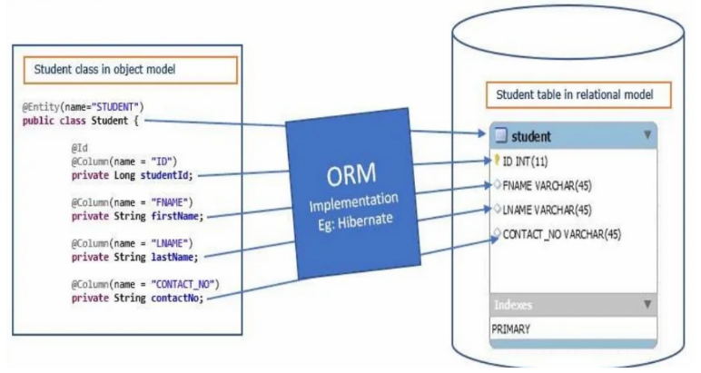

Spring Boot simplifica todo el proceso, eliminando archivos xml y clases Java de configuración.

Reutilicemos la clase `User` de anteriores prácticas, pero añadiéndole unos atributos nuevos. Lo añadiremos al constructor y le creamos sus `getters` y `setters` y nuevo `.toString()`. En el proyecto anterior creamos la clase en un paquete llamado `users` y tendrá el siguiente contenido:

```java
//Corregir el paquete por el de tu proyecto
package com.ejemplo.testdb.controllers.users;

import java.util.Random;
public class User {
	// Atributos
	private int id;
	private String userName;
	private String email;
	private String password;
	private boolean admin;

	// Constructores
	public User() {
	}

	public User(int id, String userName, String email, String password, boolean admin) {
		super();
		this.id = id;
		this.userName = userName;
		this.email = email;
		this.password = password;
		this.admin = admin;
	}

	public User(String email) {
		Random r = new Random();
		this.id = Math.abs(r.nextInt());
		this.setUserName(email);
		this.email = email;
		this.password = Integer.toHexString(this.hashCode());
		this.admin = false;
	}

	// Getters y Setters
	public int getId() {
		return id;
	}

	public void setId(int id) {
		this.id = id;
	}

	public String getUserName() {
		return userName;
	}

	public void setUserName(String userName) {
		this.userName = userName;
	}

	public String getEmail() {
		return email;
	}

	public void setEmail(String email) {
		this.email = email;
	}

	public String getPassword() {
		return password;
	}

	public void setPassword(String password) {
		this.password = password;
	}

	public boolean isAdmin() {
		return admin;
	}

	public void setAdmin(boolean admin) {
		this.admin = admin;
	}

	@Override
	public String toString() {
		return "User [id=" + id + 
				", userName=" + userName + 
				", email=" + email + 
				", password=" + password + 
				", admin=" + admin + "]";
	}
}
```

> 🌶 Es un buen momento para probar la librería Lombok y dejar la clase `User` mucho más limpia.


Ahora deberíamos de ir a nuestra base de datos, crear un script para definir la tabla Usuarios con los campos id, userName y password… etc, definir los tipos de los campos de MySQL compatibles con los tipos de Java. En resumidas cuentas, **debemos** **conocer el lenguaje SQL**, y no solo las consultas DML (*Data Manipulation Language*), si no también las DDL (*Data Definition Language*) para la creación de las bases de datos y sus restricciones.

Si más adelante, decidimos añadir un atributo a nuestra clase (o modificar alguno existente), deberemos ir de nuevo a nuestra base de datos, hacer las modificaciones pertinentes al script y actualizar la tabla con los nuevos atributos que le hayamos hecho a la clase.

Con Spring Data, sólo tenemos que añadir una serie de anotaciones, y JPA se encargará de **CREAR** la tabla por nosotros realizando las conversiones entre los tipos de datos de Java y MySQL. Las anotaciones serán las siguientes:

```java
import jakarta.persistence.Column;
import jakarta.persistence.Entity;
import jakarta.persistence.GeneratedValue;
import jakarta.persistence.Id;
import jakarta.persistence.Table;

@Entity
@Table(name="usuarios")
public class User {
	// Atributos
	@Id
	@GeneratedValue
	private int id;
	@Column(unique = true)
	private String userName;
	@Column(unique = true)
	private String email;
	@Column(name="pass")
	private String password;
	private boolean admin;
    
    //De aquí para abajo es todo igual
}
```


- Con `@Entity` especificamos que esa clase será una Entidad en la BD.
- Con `@Table` especificamos el nombre de la tabla en nuestra bd (por defecto, sin esta anotación, nos creará una tabla con el mismo nombre que la clase, `User`).
- `@Id` encima de un atributo, le indicamos que ese campo será el campo clave de la tabla, y con `@GeneratedValue` le indicamos que será un campo autogenerado.
  - `@GeneratedValue(strategy=GenerationType.AUTO)` Es la opción por defecto si no se indica nada (como en nuestro ejemplo). Permite al proveedor de la persistencia elegir la estrategia de generación de id’s.
  - `@GeneratedValue(strategy=GenerationType.IDENTITY)` Usará una columna con incremento automático que permite que la BD genere un nuevo valor para cada operación de inserción. 

- Si queremos que los nombres de los campos en MySQL sean distintos que los de la clase en Java, podemos usar anotaciones como `@Column(name="pass")`, así el atributo `password`, en la tabla se llamaría `pass`. Se recomienda usar los mismos nombres en Java y MySQL, en la medida de lo posible.

Ahora debemos añadirle unas nuevas líneas al `application.properties` para indicarle lo siguiente:

```properties
#Configuración JPA - Hibernate 
spring.jpa.hibernate.ddl-auto = update
spring.jpa.show-sql = true
```


Con `spring.jpa.hibernate.ddl-auto = update`, le decimos a JPA que se encargue de actualizar el esquema de la base de datos si fuera necesario. (Se añadió algún atributo nuevo, modificó algún tipo de datos, etc.)

Con `spring.jpa.show-sql = true` nos mostrará por consola todas las sentencias sql que serán ejecutadas por JPA. Así veremos que es lo que hace bajo el capó y podremos detectar errores.

Si reiniciamos nuestra aplicación, ya tendremos nuestra tabla creada tal y como hemos definido en nuestra clase `User`.

```sql
MariaDB [(none)]> USE dbejemplo;
Database changed
MariaDB [dbejemplo]> SHOW TABLES;
+---------------------+
| Tables_in_dbejemplo |
+---------------------+
| hibernate_sequence  |
| usuarios            |
+---------------------+
2 rows in set (0.000 sec)

MariaDB [dbejemplo]> DESCRIBE usuarios;
+-----------+--------------+------+-----+---------+-------+
| Field     | Type         | Null | Key | Default | Extra |
+-----------+--------------+------+-----+---------+-------+
| id        | int(11)      | NO   | PRI | NULL    |       |
| admin     | bit(1)       | NO   |     | NULL    |       |
| email     | varchar(255) | YES  | UNI | NULL    |       |
| pass      | varchar(255) | YES  |     | NULL    |       |
| user_name | varchar(255) | YES  | UNI | NULL    |       |
+-----------+--------------+------+-----+---------+-------+
5 rows in set (0.027 sec)

MariaDB [dbejemplo]>
```

✨Podemos fijarnos que hasta hizo la conversión del nombre `userName` a `user_name`. De *camelCase* que se usa en Java a *snake_case* que se usa en MySQL.

> 🤓**Nota**: Te habrás fijado que se creó una tabla llamada `hibernate_sequence`. La usará *hibernate* para generar  las `id` de forma secuencial automáticamente, aunque dependerá de la estrategia elegida para generarlas con la anotación `@GeneratedValue(strategy = GenerationType.*)`

# Repositorios

Para acceder a los datos, usamos servicios, que desarrollarían cada uno de los métodos para seleccionar, eliminar, actualizar e insertar objetos en la base de datos. Spring Data ofrece una nueva solución, agregando una nueva capa intermedia para el acceso a los datos, pudiendo ser usada en los servicios. **Son los repositorios**.

El repositorio es una especie de servicio que ya tiene desarrollado todos los métodos necesarios para interactuar con la base de datos, pudiendo prescindir de la típica capa DAO.

**Tan solo tenemos que definir la interfaz**. Nuestra interfaz heredará de la interfaz `JpaRepository`. **Punto, no hay más**.

```java
import org.springframework.data.jpa.repository.JpaRepository;
@Repository
public interface UserRepo extends JpaRepository<User, Integer> {
	
}
```

> 🤓 La anotación `@Repository` es opcional. Spring Boot lo usa de forma implícita. Aunque se considera una buena práctica usarla y así no nos olvidamos de poner las anotaciones `@Controller` y `@Service`, para los controladores y servicios respectivamente.

La implementación de los métodos ya están desarrollados en la clase `JpaRepository`. Tenemos que parametrizarle la clase del objeto con la que va a tratar (en nuestro ejemplo, `User`), y la clase del tipo de dato de su clave primaria (en nuestro ejemplo, `Integer`).

Y ya tenemos disponible el repositorio, que una vez esté inyectado en el controlador que queramos, podremos crear, obtener, actualizar y borrar elementos de la tabla `usuarios`, entre otras muchas cosas.

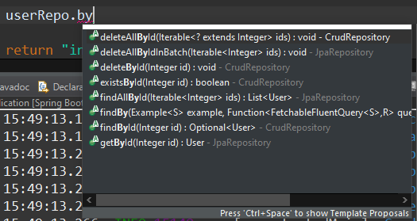

Todo esto sin tener que cargar driver con`DriverManager`, crear una conexión con `getConnection()`, datasource, crear objetos `Statement` o `PreparedStatement` y manejar ninguna instrucción SQL, que nos devuelva objetos `Resultset`, con lo entretenido que eran manejarlos. Y por supuesto capturar las mil excepciones que se podían producir en cada uno de los pasos.

> 🤓**Nota**: En algunos manuales verás que también usan `CrudRepository` en lugar de `JpaRepository`. La principal diferencia es que [`JpaRepository`](http://static.springsource.org/spring-data/data-jpa/docs/current/api/org/springframework/data/jpa/repository/JpaRepository.html) hereda de [`PagingAndSortingRepository`](http://static.springsource.org/spring-data/data-commons/docs/current/api/org/springframework/data/repository/PagingAndSortingRepository.html), que a su vez, hereda de [`CrudRepository`](http://static.springsource.org/spring-data/data-commons/docs/current/api/org/springframework/data/repository/CrudRepository.html). 
>
> - `CrudRepository` proporciona funciones de CRUD.
> - `PagingAndSortingRepository` proporciona métodos para hacer paginación y ordenar registros.
> - `JpaRepository` proporciona algunos métodos relacionados con la JPA, más todo lo anterior debido a la herencia.
>
> **Conclusión**: Depende de las funciones que usemos, podemos usar unos u otros. Si vamos a hacer un CRUD simple, bastará con `CrudRepository`.


## Usando el repositorio

Para usar nuestro repositorio, tendremos que inyectarlo donde que queramos con la anotación `@Autowired`, de la misma forma que inyectamos los servicios u otros objetos.

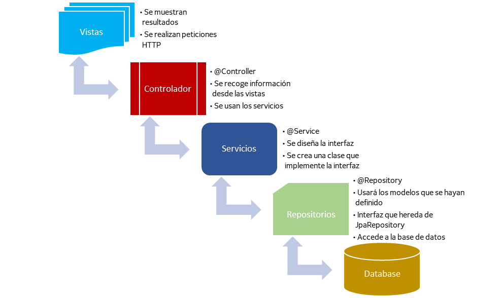

Siguiendo nuestro ejemplo, lo vamos a usar en el `HomeController` para añadir un nuevo usuario a la tabla. 

```java
@Controller
public class HomeController {
    
	private final UserRepo userRepo;
    
    public HomeController(UserRepo userRepo) {
        this.userRepo = userRepo;
    }

    //...
    
    @GetMapping("/usuario/nuevo/{email}")
	public String creaUsuario(
			@PathVariable String email
			) {
		User nuevo = new User(email);
		nuevo.setId(0);
		userRepo.save(nuevo);
		return "index";
	}
}
```

> 💡**Nota:** Aquí inyectamos el repositorio directamente en el `HomeController` para simplificar el código, pero sería conveniente crear un servicio y usar el repositorio desde el servicio, tal y como hemos visto anteriormente. 

Hemos creado un nueva url, `/usuario/nuevo/{email}` para poder crear un usuario fácilmente y guardarlo en la base de datos y probar que funciona. 

- Aunque la tabla usuarios tenga varios campos, sólo necesitamos un email. `User` tiene un constructor que sólo recibe un email y asigna automáticamente unos valores a los demás atributos (en `id` pone un número aleatorio, en `userName` usa el email, en `password` usa el *hashcode*, y por defecto `admin` = false).
- Con `@PathVariable` extraemos de la url el email que necesitamos. Con eso crea el usuario y se lo pasa por parámetro al método `userRepo.save()`. El valor del atributo `id`lo ponemos a 0 para que entienda que es un nueva inserción (ningún usuario previo tendrá la id 0).

Si escribimos en la url del proyecto, `/usuario/nuevo/pepe@ejemplo.com`, nos deberá de crear ese registro en la base de datos. Y si nos vamos a la base de datos, podemos comprobar que se grabó correctamente.

```
MariaDB [dbejemplo]> SELECT * FROM usuarios;
+----+-------+------------------+----------+------------------+
| id | admin | email            | pass     | user_name        |
+----+-------+------------------+----------+------------------+
|  1 |       | pepe@ejemplo.com | 3fbedfc0 | pepe@ejemplo.com |
+----+-------+------------------+----------+------------------+
1 row in set (0.000 sec)

MariaDB [dbejemplo]>
```

> 🧐**Nota:** Puedes observar por la consola del IDE, las consultas SQL que se enviaron a la base de datos.

El acceso a la capa de datos se ve simplificado usando los repositorios, además que su uso no depende de la estructura o tipo de base de datos que usemos, pudiendo cambiar la base de datos, sin que ello afecte a la implementación de nuestra capa DAO.

## Obtener datos

Antes de hacer un CRUD completo, veamos de una manera rápida de recuperar la información de la base de datos y mostrarla en nuestra página principal sin tener que irnos manualmente a la consola MySQL para comprobar los datos.

Pues por hacerlo de la forma más simple posible, lo haremos en el mismo método `index()` que ya tenemos creado en el `HomeController`, de forma que visualicemos los datos tan pronto entremos a la aplicación.

```java
@GetMapping("/")
public String index(Model model) {
	List<User> lista = userRepo.findAll();
	model.addAttribute("lista", lista);
	return "index";
}
```

- Inyectamos el `model`, ya que tendremos que adjuntar la lista.
- Con el método **`.findAll()`** del repositorio, ya nos devuelve directamente un `List<User>`. Lo guardamos y lo adjuntamos al `model`.
- Y mostramos la vista `index`.

Ahora ya tenemos la lista con todos los usuarios, en el modelo y podemos representarla en la vista como ya hemos hecho otras veces. Imprimimos la lista directamente en el cuerpo de la tarjeta que ya teníamos antes. Hemos usado `<code>` pero se podría en cualquier elemento HTML.

```html
...
<div class="card-body">
    <code>
        [[${lista}]]
    </code>
</div>
...
```

Al entrar la aplicación, debería mostrarse algo así:

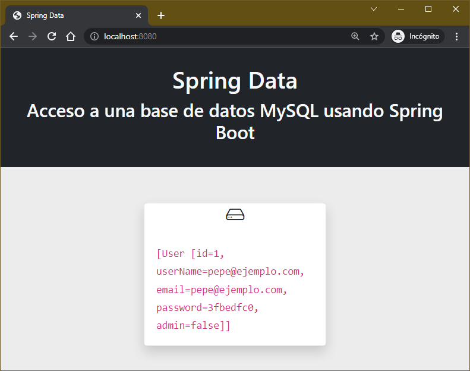

Ahora que ya sabemos que los datos están llegando perfectamente, ya podemos mejorar la forma en la que mostramos los datos, visualizándolos por ejemplo, en una tabla.

```html
<div class="card-body">
    <table class="table table-striped">
        <tr>
            <th>Id</th>
            <th>Username</th>
            <th>Email</th>
            <th>Password</th>
            <th>Admin</th>
        </tr>
        <tr th:each="user : ${lista}">
            <td>[[${user.id}]]</td>
            <td>[[${user.userName}]]</td>
            <td>[[${user.email}]]</td>
            <td>[[${user.password}]]</td>
            <td>[[${user.admin}]]</td>
        </tr>
    </table>
</div>
```

Y añadimos unos cuantos usuarios más, y así se vería finalmente.

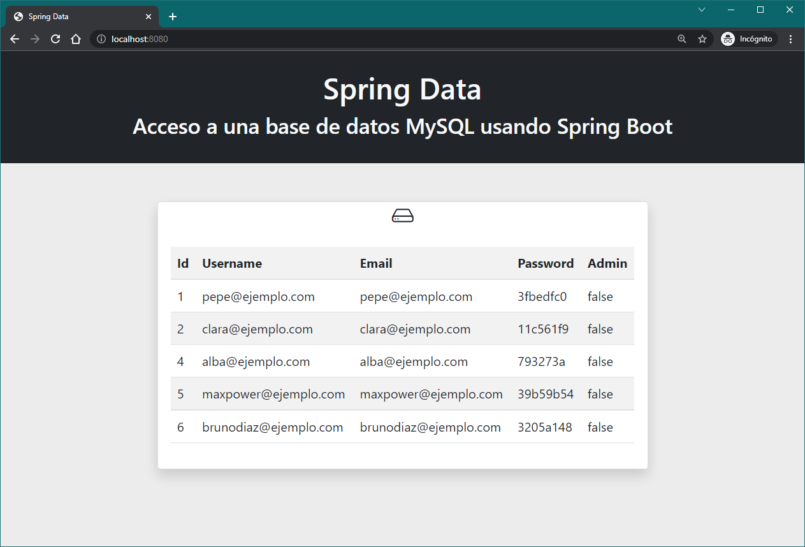

> ⚠**Atención:** Ten en cuenta que después de añadir usuarios, el controlador, nos lleva a `index.html`, pero SIN PASAR por el método que recupera los valores de la tabla y los coloca en el `model`. Por lo que la tabla saldrá vacía. Si en el método `creaUsuario()`, cambiamos el `return "index"` por `return "redirect:/"`, en lugar de llevarnos a la vista, nos REDIRECCIONARÁ a la url `/`, lo cual nos llevará al método `index()` que cargará los datos y nos llevará a `index.html`, pero ahora si, con los datos cargados en el model. Y si veremos que al crear un usuario nuevo, se refleja en la tabla.

Otro método útil para recuperar datos según una id:

- `.findById()` -> El cual recibirá una id y devolverá UN objeto (ambos del mismo tipo definido en el repositorio, respectivamente). En nuestro ejemplo, recibirá un `Integer` y devolverá un `User`.

  

## Actualizar datos

Para actualizar datos usaremos el mismo método `.save()` con la única diferencia, que el objeto que reciba el método, deberá tener la id existente de un registro en la base de datos.

```java
userActualizado.setId(6);
userActualizado.setNombre("Bruce Wayne");
userRepo.save(userActualizado);
```


## Borrar datos

Para borrar algún registro de la base de datos, los repositorios tienen muchas opciones con métodos que empiezan por `delete`.  Los más útiles son:

- `delete(User u)` -> Recibe un objeto del tipo definido como entidad en el repositorio y el método lo buscará y lo borrará.
- `deleteById(Integer id)` -> Recibe una id y borrará la entidad cuya id sea igual que la recibida.

```java
User userBuscado = userRepo.findByEmail("enrico.palazzo@acp2.com");
userRepo.delete(userBuscado); //Borramos el usuario buscado
userRepo.deleteById(5); //Borramos el usuario cuya id es 5
```


## Personalizar el repositorio

Hemos visto que los repositorios tienen muchos métodos para hacer prácticamente todo lo que necesitamos, pero, ¿y si necesito un método, por ejemplo, que me busque por `userName` y me devuelva el usuario que tenga un valor concreto en ese campo? **Pues es tan fácil como pedir un deseo**.

Definimos la firma del método que nos gustaría tener, y como por arte de magia, lo tendremos disponible en nuestro repositorio:

```java
@Repository
public interface UserRepo extends JpaRepository<User, Integer> {
	public User findByUserName(String userName);
}
```

Para probarlo, hemos hecho el método siguiente:

```java
@GetMapping("/usuario/username/{userName}")
public String findByUserName(
    @PathVariable String userName
	) {

    User userEncontrado = userRepo.findByUserName(userName);
    System.out.println(userEncontrado);

    return "index";
}
```

Y si hacemos una consulta a `/usuario/username/maxpower@ejemplo.com`, veremos por consola:

```
User [id=5, userName=maxpower@ejemplo.com, email=maxpower@ejemplo.com, password=39b59b54, admin=false]
```

🎉Funcionó, sin escribir una consulta SQL o tener que implementar el código del método `findByUserName()`. 

Vamos más allá….se puede hacer cosas tan locas como lo siguiente:

```java
public interface UserRepo extends JpaRepository<User, Integer> {
	public User findByUserNameStartingWithIgnoreCase(String userName);
	public User findByEmailAndPassword(String email, String pass);
    public boolean existsByEmailAndPassword(String email, String pass);
	public List<User> findByIdGreaterThan(int id);
	public List<User> findByEmailContaining(String emailParcial);
	public List<User> findByAdminTrue();
}
```

Nosotros decidimos si nos devuelve un `User`, o un `List<User>`. El método tendrá el prefijo **`findBy`** y contendrá el nombre de los atributos por los que se quiera filtrar unidos por los operadores `And`, `Or`, `Between`, `LessThan`, `GreaterThan`. Es la forma más simple de hacer una consulta aunque no nos servirá si tenemos muchos parámetros (el nombre del método será muy largo) o si la consulta es más compleja.

Puedes encontrar la lista completa de operadores para definir tus métodos [en el siguiente enlace de la documentación oficial.](http://docs.spring.io/spring-data/jpa/docs/current/reference/html/#jpa.query-methods.query-creation)

> ⚠**Atención:** El nombre de los atributos en los métodos deberán nombrarse de la misma forma que están definidos, usando la anotación camelCase. Si por ejemplo, el atributo es `userName`, el método deberá llamarse `findByUserName`. Sus getters y setters deberán estar bien definidos también, si no no funcionará.


# Repositorios REST

El crear una api REST a nuestro proyecto es sumamente fácil. Debemos añadir la dependencia `Rest Repositories` al crear el proyecto o añadir el siguiente trozo al `pom.xml`. Después actualizar Maven y re-arrancar el proyecto.

```xml
<dependency>
    <groupId>org.springframework.boot</groupId>
    <artifactId>spring-boot-starter-data-rest</artifactId>
</dependency>
```

Después hay que añadir unas anotaciones a nuestros repositorios para tener disponible el acceso a nuestros objetos en formato JSON a través de REST.

```java
@Repository
@RepositoryRestResource(path="usuarios")
public interface UserRepo extends JpaRepository<User, Integer> {
	...
}
```

Y ya automáticamente, al hacer una petición a `localhost:8080/usuarios` obtendremos la siguiente respuesta:

```json
{
  "_embedded": {
    "users": [
      {
        "userName": "pepe@ejemplo.com",
        "email": "pepe@ejemplo.com",
        "password": "3fbedfc0",
        "admin": false,
        "_links": {
          "self": {
            "href": "http://localhost:8080/usuarios/1"
          },
          "user": {
            "href": "http://localhost:8080/usuarios/1"
          }
        }
      },
      {
        "userName": "clara@ejemplo.com",
        "email": "clara@ejemplo.com",
        "password": "11c561f9",
        "admin": false,
        "_links": {
          "self": {
            "href": "http://localhost:8080/usuarios/2"
          },
          "user": {
            "href": "http://localhost:8080/usuarios/2"
          }
        }
      },
      {
        "userName": "alba@ejemplo.com",
        "email": "alba@ejemplo.com",
        "password": "793273a",
        "admin": true,
        "_links": {
          "self": {
            "href": "http://localhost:8080/usuarios/4"
          },
          "user": {
            "href": "http://localhost:8080/usuarios/4"
          }
        }
      },
      {
        "userName": "maxpower@ejemplo.com",
        "email": "maxpower@ejemplo.com",
        "password": "39b59b54",
        "admin": false,
        "_links": {
          "self": {
            "href": "http://localhost:8080/usuarios/5"
          },
          "user": {
            "href": "http://localhost:8080/usuarios/5"
          }
        }
      },
      {
        "userName": "brunodiaz@ejemplo.com",
        "email": "brunodiaz@ejemplo.com",
        "password": "3205a148",
        "admin": true,
        "_links": {
          "self": {
            "href": "http://localhost:8080/usuarios/6"
          },
          "user": {
            "href": "http://localhost:8080/usuarios/6"
          }
        }
      },
      {
        "userName": "fernandosimon@ejemplo.com",
        "email": "fernandosimon@ejemplo.com",
        "password": "42c664c8",
        "admin": false,
        "_links": {
          "self": {
            "href": "http://localhost:8080/usuarios/7"
          },
          "user": {
            "href": "http://localhost:8080/usuarios/7"
          }
        }
      },
      {
        "userName": "enricopalazzo@otrodominio.com",
        "email": "enricopalazzo@otrodominio.com",
        "password": "7206eaeb",
        "admin": false,
        "_links": {
          "self": {
            "href": "http://localhost:8080/usuarios/8"
          },
          "user": {
            "href": "http://localhost:8080/usuarios/8"
          }
        }
      }
    ]
  },
  "_links": {
    "self": {
      "href": "http://localhost:8080/usuarios"
    },
    "profile": {
      "href": "http://localhost:8080/profile/usuarios"
    },
    "search": {
      "href": "http://localhost:8080/usuarios/search"
    }
  },
  "page": {
    "size": 20,
    "totalElements": 7,
    "totalPages": 1,
    "number": 0
  }
}
```

Y una petición a `localhost:8080/usuarios/8` obtendremos la siguiente respuesta:

```json
{
  "userName": "enricopalazzo@otrodominio.com",
  "email": "enricopalazzo@otrodominio.com",
  "password": "7206eaeb",
  "admin": false,
  "_links": {
    "self": {
      "href": "http://localhost:8080/usuarios/8"
    },
    "user": {
      "href": "http://localhost:8080/usuarios/8"
    }
  }
}
```

## Personalizar la url base

Podemos añadir una ruta url base para todo el rest, añadiendo la siguiente configuración en el `application.properties`:

```properties
spring.data.rest.basePath=/api/v1
```

Así para usar las rutas anteriores, deberíamos ir a `localhost:8080/api/v1/usuarios`. Así tendríamos por un lado el acceso al api rest en una ruta, y nuestros controladores por otra.

## Acepta peticiones de otros verbos

El API Rest que “hemos montado 😉😉”, no sólo nos devolverá en formato JSON los objetos que exista en la base de datos, también aceptará peticiones POST, PUT, DELETE, PATCH, etc. 

Veamos como desde postman acepta una petición `POST`, y lo inserta en la base de datos.

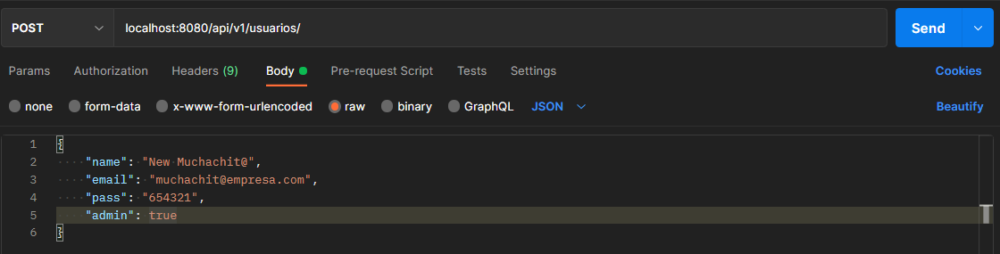

```
MariaDB [crud_usuarios]> select * from usuarios;
+----+----------------+----------------------------+--------+-------+
| id | name           | email                      | pass   | admin |
+----+----------------+----------------------------+--------+-------+
|  1 | Administrador  | admin@empresa.com          | 654321 | ☺     |
|  2 | Usuario        | user@empresa.com           | 123456 |       |
|  3 | Visor          | visor@empresa.com          | 123456 |       |
|  4 | Max Power      | max.power@empresa.com      | 123456 |       |
|  5 | Bruno Díaz     | bruce.wayne@empresa.com    | 123456 |       |
|  6 | Enrico Palazzo | enricco.palazo@empresa.com | 123456 |       |
|  7 | Ricardo Tapia  | ri.cardo@empresa.com       | 123456 |       |
|  9 | New Muchachit@ | muchachit@empresa.com      | 654321 | ☺     |
+----+----------------+----------------------------+--------+-------+
8 rows in set (0.000 sec)
```

Y como acepta una petición `DELETE` y lo borra sin problemas.

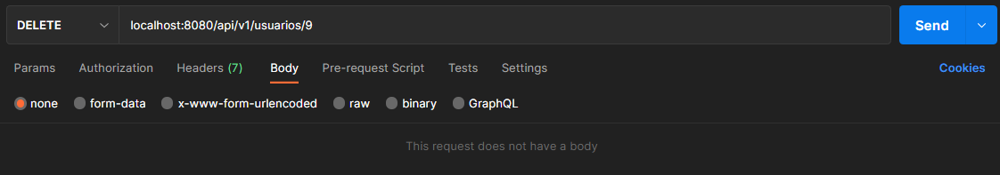

## Búsquedas personalizadas

Si vamos a `localhost:8080/api/v1/usuarios/search` nos mostrará todos los métodos personalizados que hayamos definido en nuestro repositorio, pudiendo usarlos también desde el API REST:

```json
{
  "_links" : {
    "findByEmailAndPass" : {
      "href" : "http://localhost:8080/api/v1/usuarios/search/findByEmailAndPass{?email,pass}",
      "templated" : true
    },
    "self" : {
      "href" : "http://localhost:8080/api/v1/usuarios/search/"
    }
  }
}
```

`localhost:8080/api/v1/usuarios/search/findByEmailAndPass?email=ri.cardo@empresa.com&pass=123456`

```json
{
  "name" : "Ricardo Tapia",
  "email" : "ri.cardo@empresa.com",
  "pass" : "123456",
  "admin" : false,
  "_links" : {
    "self" : {
      "href" : "http://localhost:8080/api/v1/usuarios/7"
    },
    "usuario" : {
      "href" : "http://localhost:8080/api/v1/usuarios/7"
    }
  }
}
```


# CRUD Completo

Veamos una aplicación final, usando todo lo visto durante el curso. 

1. Haremos un login, el cual tendremos que autentificarnos con un usuario y contraseña que deberá estar registrado en la base de datos.
2. Una vez hagamos login, guardará el usuario en la sesión y mientras no se cierre, iremos directamente a la página principal.
3. En la página principal habrá un listado de una tabla de una base de datos, en el cual podremos añadir nuevos registros, modificar su contenido y borrarlos.
4. Opcionalmente, podemos restringir las opciones de añadir, borrar y editar sólo para usuarios con rol de administrador.
5. Podremos cerrar sesión, de forma que nos llevará de nuevo al login.

Encontrarás la vistas y las estructuras incompletas de algunas clases y servicios en el repositorio siguiente:  

> https://github.com/borilio/curso-spring-boot/tree/master/assets/clases/practica-7 

En la carpeta `/resources/sql` del repositorio de GIT encontrarás los scripts SQL necesarios para crear el esquema (`squema.sql`) y los datos (`data.sql`).

## Vista previa

Login inicial:

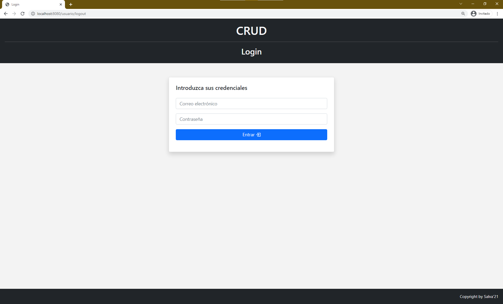

Menú principal:

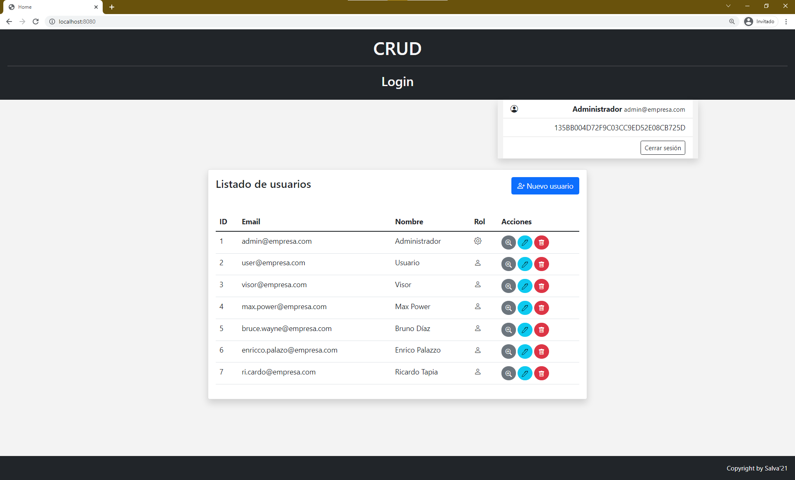

Nuevo usuario:

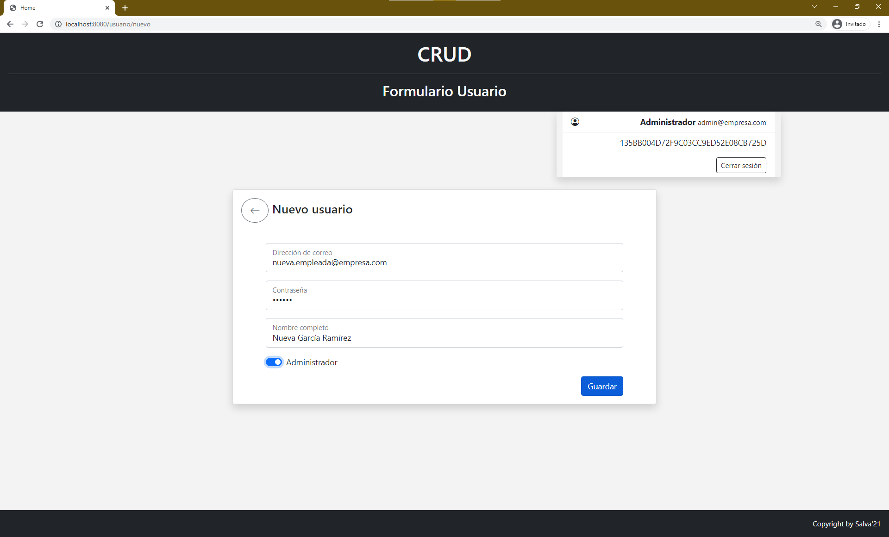

Comprobación de nuevo usuario creado:

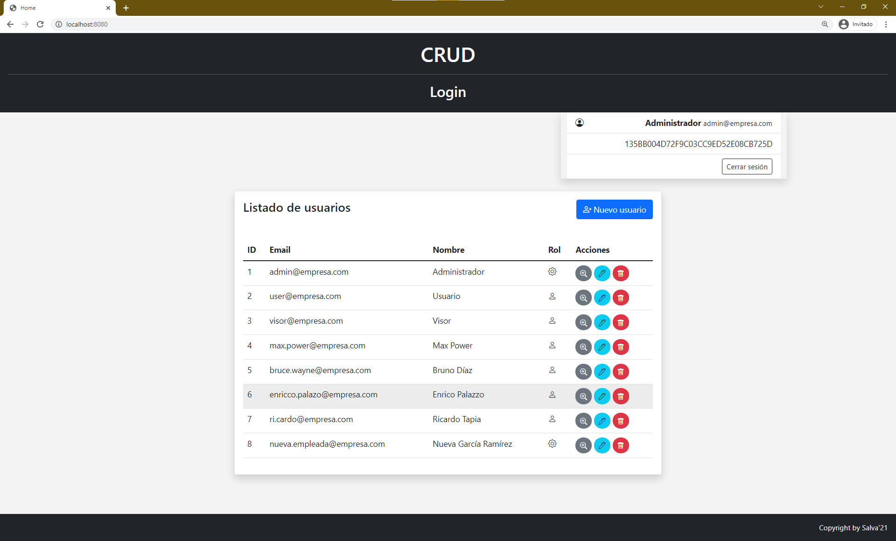

Editamos ese nuevo usuario (nos volcará la información en el formulario):

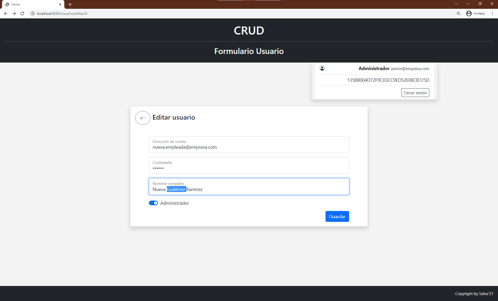

Comprobamos la actualización de sus datos:

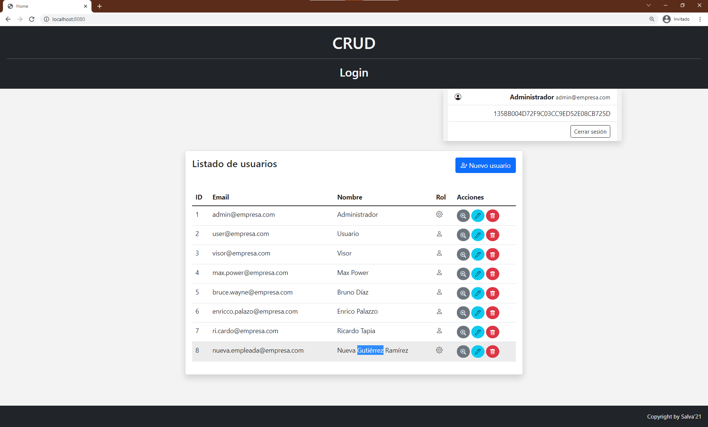

Borramos el usuario nuevo:

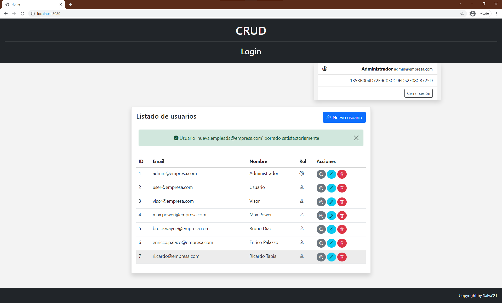

Cerramos sesión:

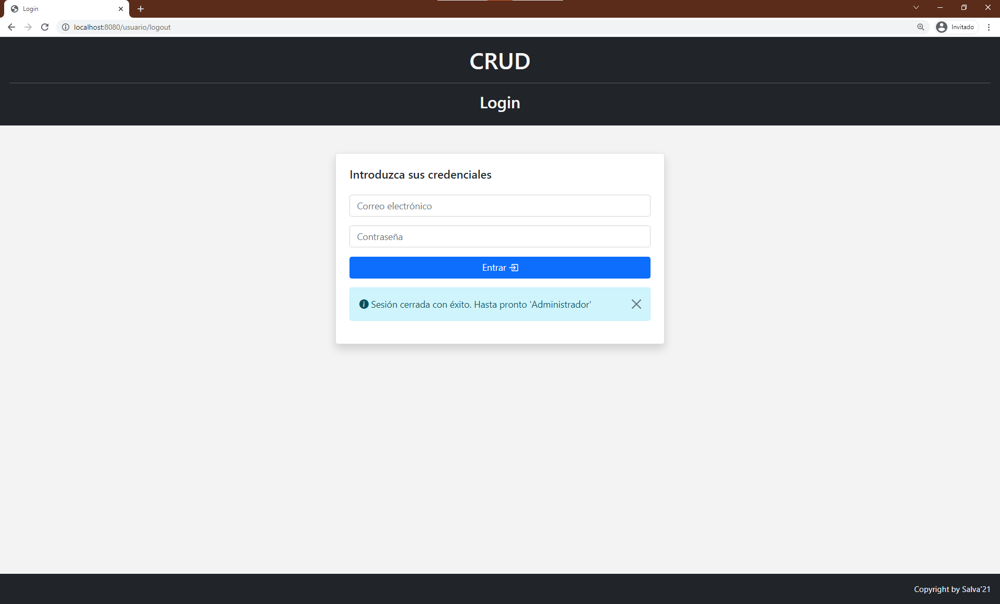


# Anexo: Persistencia con JPA en base de datos relacionales

🚧 En construcción. Usar con precaución 🚧

Este documento completo trata la persistencia de tablas independientes, que no están relacionadas con otras. En este apartado veremos como se usan en JPA una base de datos que posee relaciones entre tablas.

## Proyecto inicial

En el siguiente repositorio, está el proyecto completo que nos servirá de ejemplo, con commits en cada punto importante para ver el proyecto desde el inicio y los cambios realizados durante la evolución del ejemplo.

> 👨‍💻 https://github.com/borilio/curso-spring-boot-ejemplo-jpa

Para simplificar, no tendremos vistas y solo tendremos una API REST creada con los repositorios, por lo que no tendremos `controllers`, si no únicamente los modelos (o beans) y sus correspondientes repositorios.

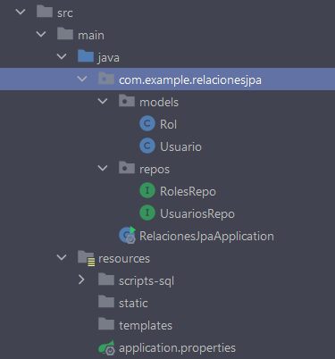

> 👨‍💻 El proyecto tiene momentos concretos señalados, identificados por un commit a git, para que se pueda ver el código fuente de proyecto en un momento especial dado. A continuación mostramos el primer momento, por si necesitas ver el código de los modelos o de los repositorios, o de cualquier otro archivo del proyecto.

> 🕰**Momento 1**: Definidos Usuarios y Roles, y sus correspondientes repositorios. 
>
> https://github.com/borilio/curso-spring-boot-ejemplo-jpa/tree/4bf2f8a767376108be33172ac8e4969ad0ee7d30

Ahora mismo, si arrancamos el proyecto y vamos a `http://localhost:8080/api/usuarios`  nos mostrará un JSON con los usuarios:

```json
{
    "_embedded": {
        "usuarios": [
            {
                "idRol": 1,
                "nombre": "Admin 1",
                "correo": "admin1@empresa.com",
                "clave": "654321",
                "_links": {
                    "self": {
                        "href": "http://localhost:8080/api/usuarios/1"
                    },
                    "usuario": {
                        "href": "http://localhost:8080/api/usuarios/1"
                    }
                }
            },
            {
                "idRol": 1,
                "nombre": "Admin 2",
                "correo": "admin2@empresa.com",
                "clave": "654321",
                "_links": {
                    "self": {
                        "href": "http://localhost:8080/api/usuarios/2"
                    },
                    "usuario": {
                        "href": "http://localhost:8080/api/usuarios/2"
                    }
                }
            },
            {
                "idRol": 2,
                "nombre": "Usuario",
                "correo": "user@empresa.com",
                "clave": "123456",
                "_links": {
                    "self": {
                        "href": "http://localhost:8080/api/usuarios/3"
                    },
                    "usuario": {
                        "href": "http://localhost:8080/api/usuarios/3"
                    }
                }
            },
            {
                "idRol": 3,
                "nombre": "Visor",
                "correo": "visor@empresa.com",
                "clave": "123456",
                "_links": {
                    "self": {
                        "href": "http://localhost:8080/api/usuarios/4"
                    },
                    "usuario": {
                        "href": "http://localhost:8080/api/usuarios/4"
                    }
                }
            }
        ]
    },
    "_links": {
        "self": {
            "href": "http://localhost:8080/api/usuarios"
        },
        "profile": {
            "href": "http://localhost:8080/api/profile/usuarios"
        },
        "search": {
            "href": "http://localhost:8080/api/usuarios/search"
        }
    },
    "page": {
        "size": 20,
        "totalElements": 4,
        "totalPages": 1,
        "number": 0
    }
}
```

E igualmente con los roles en `http://localhost:8080/api/roles`:

```json
{
    "_embedded": {
        "rols": [
            {
                "rol": "administrador",
                "_links": {
                    "self": {
                        "href": "http://localhost:8080/api/roles/1"
                    },
                    "rol": {
                        "href": "http://localhost:8080/api/roles/1"
                    }
                }
            },
            {
                "rol": "usuario",
                "_links": {
                    "self": {
                        "href": "http://localhost:8080/api/roles/2"
                    },
                    "rol": {
                        "href": "http://localhost:8080/api/roles/2"
                    }
                }
            },
            {
                "rol": "visor",
                "_links": {
                    "self": {
                        "href": "http://localhost:8080/api/roles/3"
                    },
                    "rol": {
                        "href": "http://localhost:8080/api/roles/3"
                    }
                }
            }
        ]
    },
    "_links": {
        "self": {
            "href": "http://localhost:8080/api/roles"
        },
        "profile": {
            "href": "http://localhost:8080/api/profile/roles"
        }
    },
    "page": {
        "size": 20,
        "totalElements": 3,
        "totalPages": 1,
        "number": 0
    }
}
```

Por ahora no hay nada nuevo, vemos como cada repositorio nos da los elementos de cada entidad, por separado sin tener en cuenta las relaciones que están definidas en la base de datos.


## Esquema Entidad-Relación

En el proyecto, tenemos una base de datos simple con varias relaciones, pero nos centraremos por ahora en los Usuarios y los Roles. Cada `usuario` tiene un `rol` definido en otra tabla.

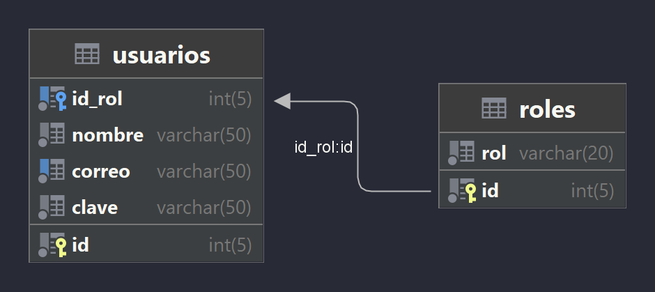

## Obteniendo información de otras tablas

Ahora mismo, con los repositorios obtenemos la información que hay en las tablas TAL CUAL. Es decir, que si obtengo la lista de usuarios, tendré un `List<Usuario>` donde cada `Usuario` tiene los atributos tal cual están definidos, por lo que podré saber la `id_rol` que tiene el usuario (1, 2, 3, etc.), pero no tendré información del nombre del `rol` (“administrador”, “visor”, “usuario”, etc.).

**¿Cómo podemos obtener esa información?** Pues sustituyendo el atributo de la clave foránea por el objeto al que hace referencia en la otra tabla además de usar las anotaciones que indicamos a continuación.

En nuestro ejemplo sería cambiando el atributo `id_rol`, por un objeto de la clase `Rol`, y usando las anotaciones correctas.

### @ManyToOne - de muchos a uno

Como la relación entre `usuarios` y `roles` es de muchos a uno (un rol está muchas veces en la tabla `usuarios`, y una única vez en la tabla `roles`), pues debemos hacer los siguientes cambios:

1. En la clase `Usuario`, eliminamos el atributo `id_rol` y lo sustituimos por un objeto de la clase `Rol`.
2. Le añadimos la anotación `@ManyToOne`, para indicar el tipo de relación que hay con ese atributo.
3. Le añadimos la anotación `@JoinColumn`, para indicar los campos que se relacionan en ambas entidades. Tiene los siguientes argumentos:
   * `name` : Le indicamos el campo de ESTA entidad que representa la clave foránea.
   * `referencedColumnName`:  Le indicamos el campo clave de la tabla a la que hace referencia.
4. No es necesario hacer ningún cambio en la clase `Rol`, ni en ninguno de los dos repositorios.

El código de la clase `Usuario` quedaría así:

> 🌶 Para simplificar el código, estamos usando Lombok

```java
@Data
@NoArgsConstructor
@AllArgsConstructor
@Entity
@Table(name = "usuarios")
public class Usuario {
    @Id
    @GeneratedValue(strategy = GenerationType.IDENTITY)
    private int id;
    @ManyToOne
    @JoinColumn(name = "id_rol", referencedColumnName = "id")
    private Rol rol;
    private String nombre;
    private String correo;
    private String clave;
}
```

> 🕰**Momento 2**: Modificamos la clase Usuario para cambiar la `id_rol` por un objeto de la clase `Rol`. 
>
> https://github.com/borilio/curso-spring-boot-ejemplo-jpa/tree/13f5c9c4c6571eb0b40986c93f5c3e257d507913

Usando los repositorios en cualquier parte de la aplicación (servicios, controlador, testing, etc), obtenemos el usuario con `id=1` usando la siguiente sentencia:

```java
//Obtenemos el usuario con id=1 y lo imprimimos por consola...
System.out.println(usuariosRepo.findById(1).orElse(null));
```

**Antes**, sin usar las anotaciones y clases correspondientes, obtendríamos:

````
Usuario(id=1, id_rol=1, nombre=Admin 1, correo=admin1@empresa.com, clave=654321)
````

**Ahora**, usando las relaciones correctamente, obtenemos esto:

```
Usuario(id=1, rol=Rol(id=1, rol=administrador), nombre=Admin 1, correo=admin1@empresa.com, clave=654321)
```

Antes únicamente obtenemos `id_rol`, ahora tenemos un objeto de la clase `Rol`, relleno con todos los valores correctos para esa id concreta.

Por la parte del REST, veremos los siguientes cambios:

Si accedemos a `http://localhost:8080/usuarios/1`, obtendremos:

```json
{
    "nombre": "Admin 1",
    "correo": "admin1@empresa.com",
    "clave": "654321",
    "_links": {
        "self": {
            "href": "http://localhost:8080/api/usuarios/1"
        },
        "usuario": {
            "href": "http://localhost:8080/api/usuarios/1"
        },
        "rol": {
            "href": "http://localhost:8080/api/usuarios/1/rol"
        }
    }
}
```

Y vemos que ahora podemos ir a `http://localhost:8080/usuarios/1/rol`, en la cual obtendremos:

```json
{
    "rol": "administrador",
    "_links": {
        "self": {
            "href": "http://localhost:8080/api/roles/1"
        },
        "rol": {
            "href": "http://localhost:8080/api/roles/1"
        }
    }
}
```


En la misma base de datos hay varias relaciones iguales, de muchos a uno, y que haciendo lo mismo que con los usuarios, podríamos:

* Obtener los tipos de centrales nucleares
* Obtener el nombre de la provincia de la central nuclear
* Obtener la central nuclear que originó una incidencia
* Obtener el usuario que originó la incidencia

### @OneToMany - de uno a muchos

Si queremos bidireccionalidad en la relación, podemos usar anotaciones para indicar la relación contraria en la otra dirección. Es decir, si antes estamos obteniendo la información del rol para cada usuario, ahora podríamos obtener los usuarios que usen un determinado rol.

En la tabla contraria, podemos añadirle una lista de usuarios, y automáticamente, podremos obtener los usuarios que tengan una id de rol concreta.

Añadiendo la anotación `@OneToMany` decimos que “un mismo rol, lo pueden tener muchos usuarios”. Y con el argumento `mappedBy` le indicamos el atributo de la otra entidad el cual tiene que pertenecer a esta entidad (le decimos `mappedBy="rol"` porque  queremos obtener una `List<Usuario>` que tengan como atributo un determinado **`rol`**).

```java
@Data
@NoArgsConstructor
@AllArgsConstructor
@Entity
@Table(name = "roles")
public class Rol {
    @Id
    @GeneratedValue(strategy = GenerationType.IDENTITY)
    private int id;
    private String rol;
    @OneToMany(mappedBy = "rol")
    private List<Usuario> usuarios;
}
```

> 🕰**Momento 3:** Modificamos la clase Rol para añadir una bidireccionalidad la relación con `@OneToMany`.
>
> https://github.com/borilio/curso-spring-boot-ejemplo-jpa/tree/2b91a3a0f324681be3956d39639fc4f78523406d

Ahora podemos hacer la petición `http://localhost:8080/api/roles/1/usuarios` y nos mostrará un JSON con los **usuarios que tengan el rol con id 1**:

```json
{
    "_embedded": {
        "usuarios": [
            {
                "nombre": "Admin 1",
                "correo": "admin1@empresa.com",
                "clave": "654321",
                "_links": {
                    "self": {
                        "href": "http://localhost:8080/api/usuarios/1"
                    },
                    "usuario": {
                        "href": "http://localhost:8080/api/usuarios/1"
                    },
                    "rol": {
                        "href": "http://localhost:8080/api/usuarios/1/rol"
                    }
                }
            },
            {
                "nombre": "Admin 2",
                "correo": "admin2@empresa.com",
                "clave": "654321",
                "_links": {
                    "self": {
                        "href": "http://localhost:8080/api/usuarios/2"
                    },
                    "usuario": {
                        "href": "http://localhost:8080/api/usuarios/2"
                    },
                    "rol": {
                        "href": "http://localhost:8080/api/usuarios/2/rol"
                    }
                }
            }
        ]
    },
    "_links": {
        "self": {
            "href": "http://localhost:8080/api/roles/1/usuarios"
        }
    }
}
```

> ⚠ No podremos probar este tipo de relaciones en testing, ya que al no tener una sesión creada provocará una excepción del tipo `org.hibernate.LazyInitializationException`


